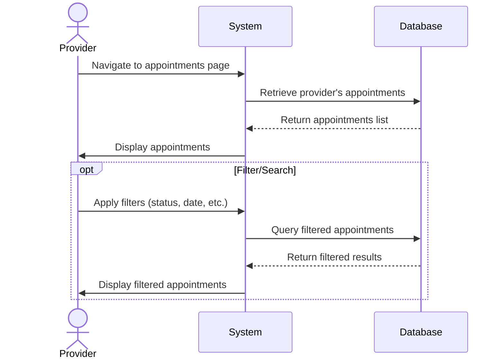
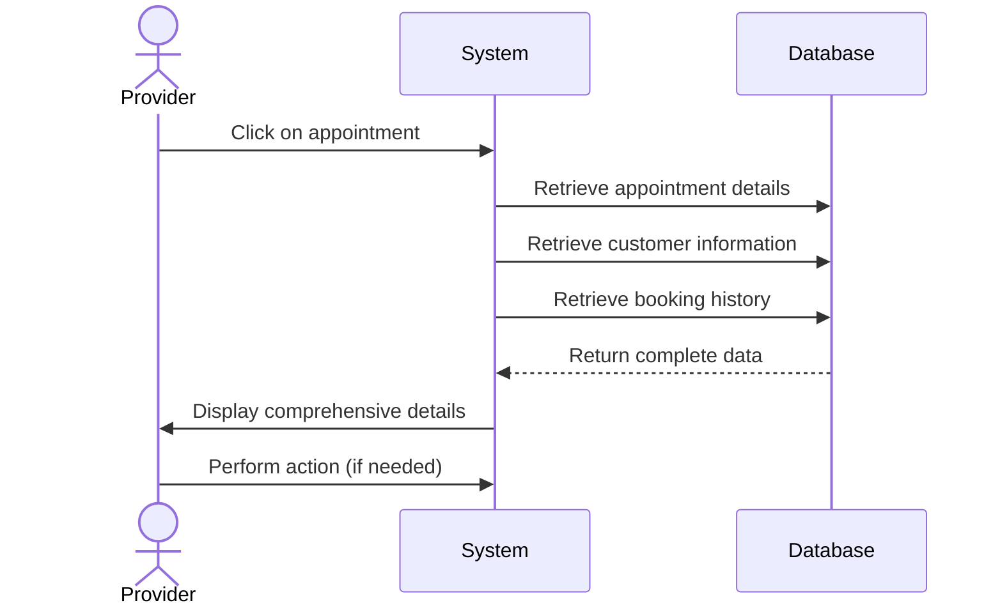
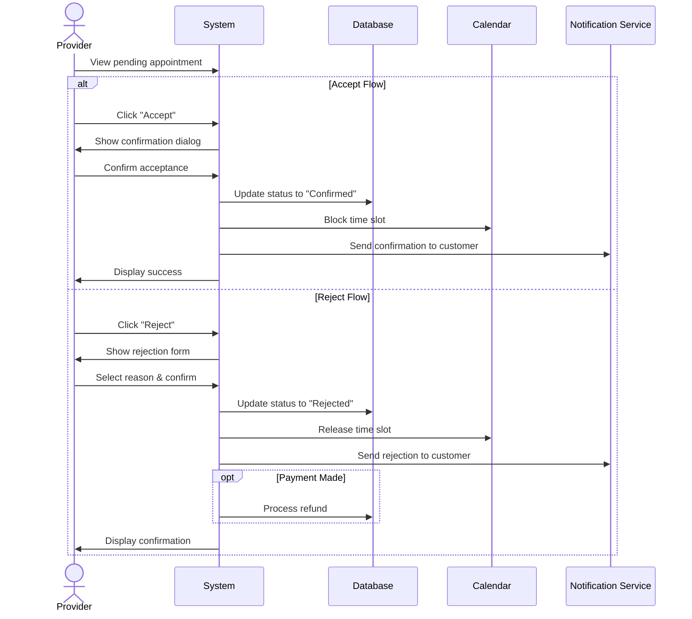
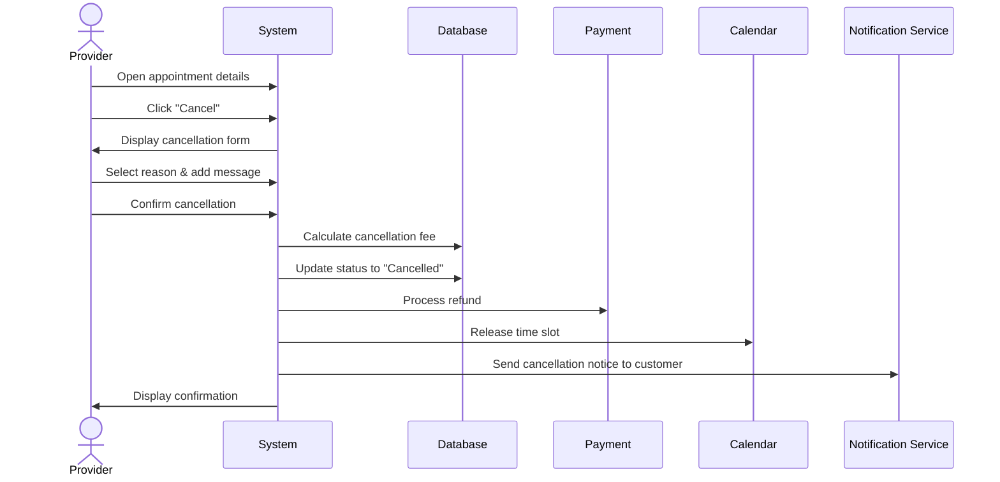
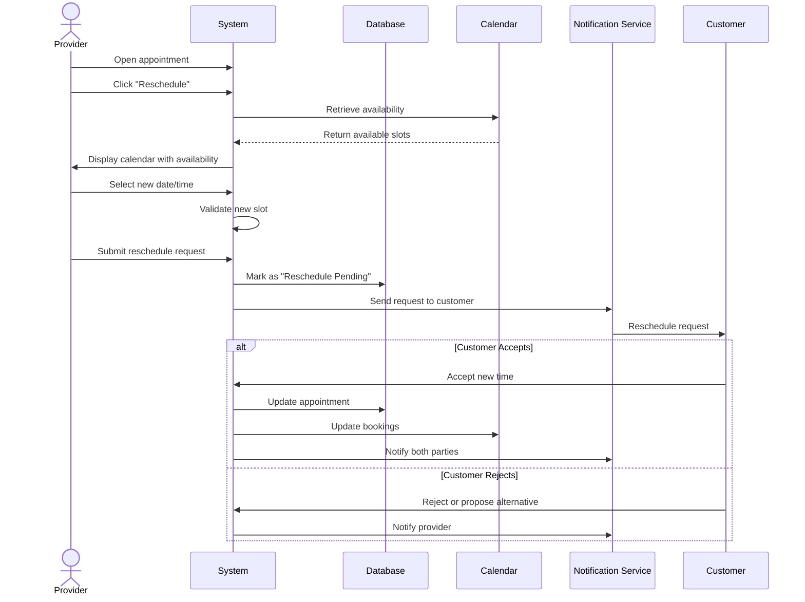

# Appointment Management Use Cases

## UC-015: View Appointments

**Actor**: Provider  
**Preconditions**: Provider is logged in  
**Page**: `/provider/appointments`

### Diagram

### Main Flow
1. Provider navigates to appointments page
2. System retrieves all appointments for the provider
3. System displays appointments in list view with:
   - Customer name
   - Service name
   - Company name
   - Date and time
   - Duration
   - Status (Pending, Confirmed, Completed, Cancelled)
   - Price
   - Quick action buttons
4. Provider can view different appointment views:
   - All appointments
   - Today's appointments
   - Upcoming appointments
   - Past appointments
   - Pending requests
5. Provider can filter and sort appointments

### Alternative Flows
**A1: No Appointments**
- System displays empty state
- System shows helpful message
- System suggests promoting services

**A2: Filter by Status**
- Provider selects status filter
- System displays only matching appointments

**A3: Filter by Date Range**
- Provider selects date range
- System displays appointments within range

**A4: Filter by Company/Service**
- Provider selects company or service filter
- System displays relevant appointments

**A5: Search Appointments**
- Provider enters search term (customer name, booking ID)
- System displays matching results

### Postconditions
- Provider views their appointments
- Provider can take actions on appointments

### Business Rules
- Appointments are sorted by date/time by default
- Past appointments older than 1 year are archived
- Cancelled appointments are marked but retained
- List is paginated for performance

---

## UC-016: View Appointment Details

**Actor**: Provider  
**Preconditions**: Provider has appointments  
**Page**: `/provider/appointments/:id`

### Diagram

### Main Flow
1. Provider clicks on an appointment
2. System retrieves detailed appointment information
3. System displays comprehensive details:
   - **Customer Information**
     - Name
     - Contact details
     - Customer notes
     - Booking history
   - **Appointment Information**
     - Service details
     - Date and time
     - Duration
     - Location
     - Status
   - **Booking Details**
     - Booking ID
     - Booking date
     - Payment status
     - Total amount
     - Special requests
   - **Action Options**
     - Confirm/Reject (if pending)
     - Cancel
     - Reschedule
     - Mark as completed
     - Add notes
     - Contact customer
4. Provider can perform actions on the appointment

### Alternative Flows
**A1: Customer is New**
- System highlights first-time customer
- System shows complete customer profile
- Suggests sending welcome message

**A2: Special Requests Present**
- System highlights customer's special requests
- Provider can acknowledge requests
- Provider can add response notes

**A3: Payment Pending**
- System shows payment status prominently
- System displays payment options
- Provider can send payment reminder

### Postconditions
- Provider has complete appointment information
- Provider can make informed decisions
- Actions are available based on appointment status

### Business Rules
- All customer information is visible only to appointment provider
- Contact information is accessible based on privacy settings
- Action options depend on appointment status and time
- Historical notes and interactions are preserved

---

## UC-017: Accept/Reject Appointment

**Actor**: Provider  
**Preconditions**: Appointment is in "Pending" status  
**Page**: `/provider/appointments/:id`

### Diagram

### Main Flow - Accept
1. Provider views pending appointment
2. Provider clicks "Accept" button
3. System displays confirmation dialog
4. Provider adds optional message to customer
5. Provider confirms acceptance
6. System updates appointment status to "Confirmed"
7. System sends confirmation notification to customer
8. System adds appointment to provider's calendar
9. System displays success message

### Main Flow - Reject
1. Provider views pending appointment
2. Provider clicks "Reject" button
3. System displays rejection form
4. Provider selects rejection reason:
   - Not available at requested time
   - Service not offered
   - Outside service area
   - Other (with explanation)
5. Provider adds message to customer (optional)
6. Provider confirms rejection
7. System updates appointment status to "Rejected"
8. System sends rejection notification to customer
9. System processes refund (if payment made)
10. System displays confirmation

### Alternative Flows
**A1: Counter-Offer Time**
- Provider clicks "Suggest Alternative Time"
- System shows available time slots
- Provider selects alternative times
- System sends proposal to customer
- Customer can accept or decline

**A2: Request More Information**
- Provider clicks "Request Information"
- Provider specifies what information is needed
- System sends request to customer
- Appointment remains pending

**A3: Bulk Accept/Reject**
- Provider selects multiple pending appointments
- Provider chooses bulk action
- System processes all selected appointments
- Notifications sent to all affected customers

### Postconditions
**Accept**: 
- Appointment is confirmed
- Time slot is blocked in calendar
- Customer is notified
- Provider receives booking confirmation

**Reject**:
- Appointment is cancelled
- Time slot is released
- Customer is notified with reason
- Refund is processed if applicable

### Business Rules
- Pending appointments auto-reject after 24 hours if no action
- Rejection requires a reason
- Refunds are automatic for rejections
- Customer receives notification within 5 minutes
- Accepted appointments cannot be easily cancelled

---

## UC-018: Cancel Appointment

**Actor**: Provider  
**Preconditions**: Appointment is confirmed or pending  
**Page**: `/provider/appointments/:id`

### Diagram

### Main Flow
1. Provider opens appointment details
2. Provider clicks "Cancel" button
3. System displays cancellation form with:
   - Cancellation reason options
   - Custom message field
   - Refund policy information
   - Impact warning
4. Provider selects cancellation reason
5. Provider adds explanation message
6. Provider reviews cancellation policy
7. Provider confirms cancellation
8. System updates appointment status to "Cancelled"
9. System processes refund according to policy
10. System sends cancellation notification to customer
11. System releases time slot
12. System displays confirmation

### Alternative Flows
**A1: Cancellation with Fee**
- System calculates cancellation fee based on timing
- System displays fee to provider
- Provider acknowledges fee responsibility
- System proceeds with cancellation

**A2: Late Cancellation (< 24 hours)**
- System warns about late cancellation policy
- System shows impact on provider rating
- Provider confirms understanding
- System proceeds with full refund to customer

**A3: Customer-Requested Cancellation**
- Customer initiates cancellation
- System notifies provider
- Provider can accept or dispute
- System processes accordingly

**A4: Emergency Cancellation**
- Provider marks as emergency
- System prioritizes notification
- System offers rebooking assistance
- Customer receives immediate alert

### Postconditions
- Appointment is cancelled
- Customer is notified
- Refund is processed
- Time slot is available again
- Cancellation is recorded in history

### Business Rules
- Cancellations >48 hours: no penalty
- Cancellations 24-48 hours: provider warning recorded
- Cancellations <24 hours: impacts provider rating
- Full refund to customer in all cases
- Excessive cancellations may trigger review
- Customer can rebook with 10% discount code

---

## UC-019: Reschedule Appointment

**Actor**: Provider  
**Preconditions**: Appointment exists and is not completed  
**Page**: `/provider/appointments/:id`

### Diagram

### Main Flow
1. Provider opens appointment details
2. Provider clicks "Reschedule" button
3. System displays provider's calendar with availability
4. Provider selects new date and time
5. System validates:
   - Time slot is available
   - Meets minimum advance notice
   - Within service availability
6. Provider adds reason for rescheduling (optional)
7. Provider adds message to customer
8. Provider submits reschedule request
9. System sends reschedule request to customer
10. System marks appointment as "Reschedule Pending"
11. Customer accepts or rejects
12. System updates appointment accordingly
13. System notifies provider of customer's decision

### Alternative Flows
**A1: Customer Accepts Reschedule**
- Customer accepts new time
- System updates appointment
- Both parties receive confirmation
- Calendar is updated

**A2: Customer Rejects Reschedule**
- Customer rejects new time
- Customer can propose alternative
- Provider can accept customer's suggestion
- If no agreement, appointment gets cancelled

**A3: Direct Reschedule (Provider Authority)**
- Provider has permission for direct changes
- System reschedules without approval request
- Customer receives notification of change
- Customer can cancel with full refund

**A4: Multiple Time Options**
- Provider offers 2-3 alternative times
- Customer selects preferred option
- System confirms selected time
- Other options are released

**A5: Reschedule Conflict**
- New time conflicts with another booking
- System prevents double-booking
- Provider must select different time

### Postconditions
- Appointment is rescheduled (if accepted)
- Both parties have updated information
- Calendar reflects changes
- Notifications are sent
- Original time slot is released

### Business Rules
- Reschedule requires at least 12 hours notice
- Customer approval required unless policy allows direct changes
- Maximum 3 reschedule requests per appointment
- No charge for provider-initiated reschedules
- Customer-requested reschedules follow cancellation policy timing
- Rescheduling window: between tomorrow and 60 days ahead

---

*Last updated: March 6, 2026*
