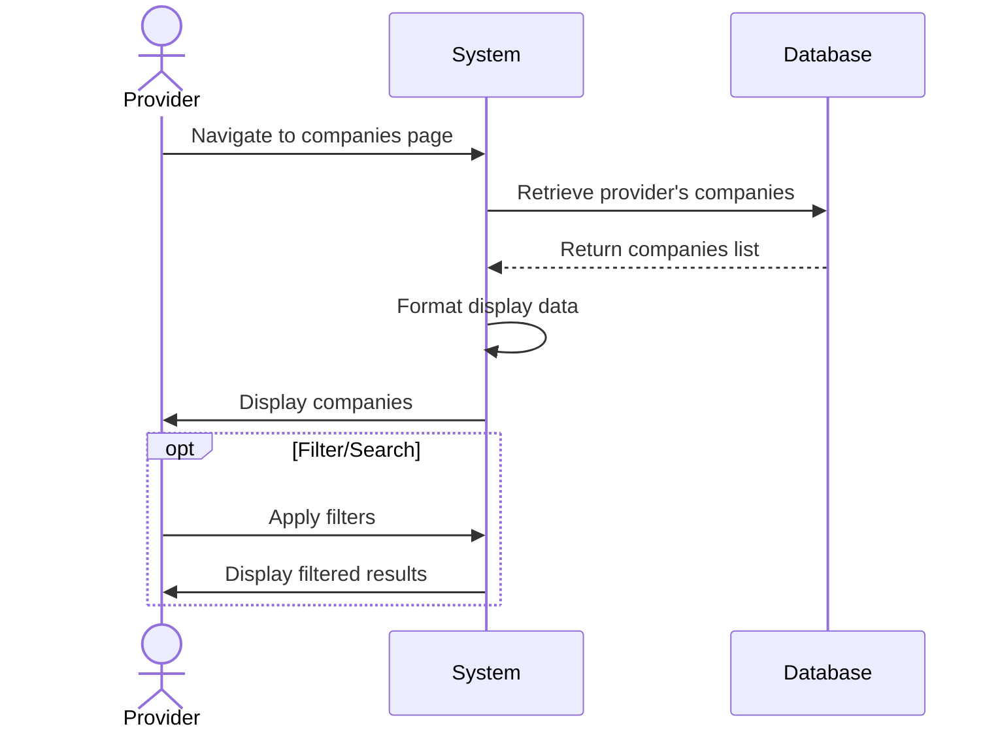
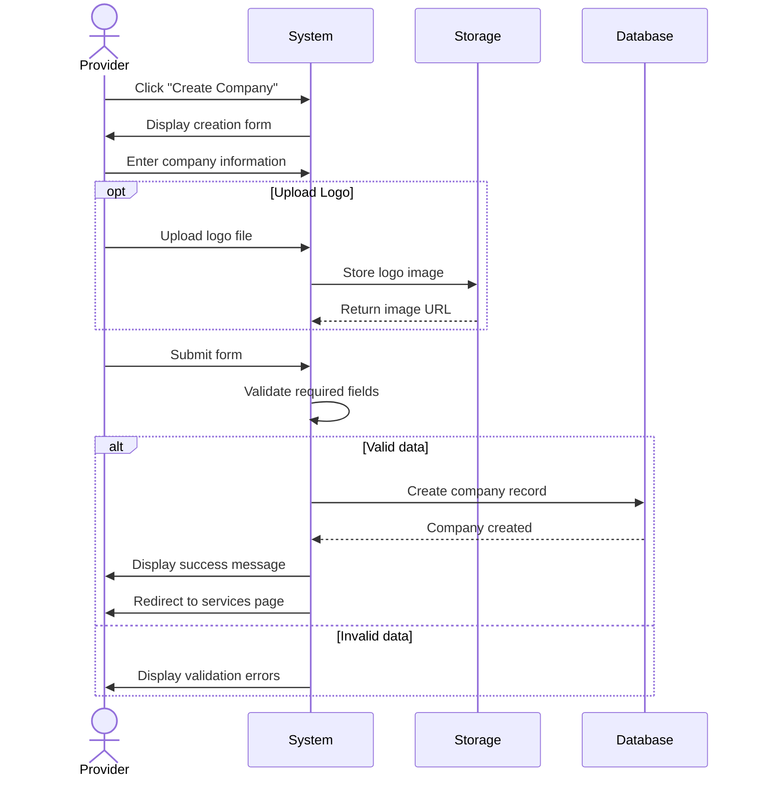
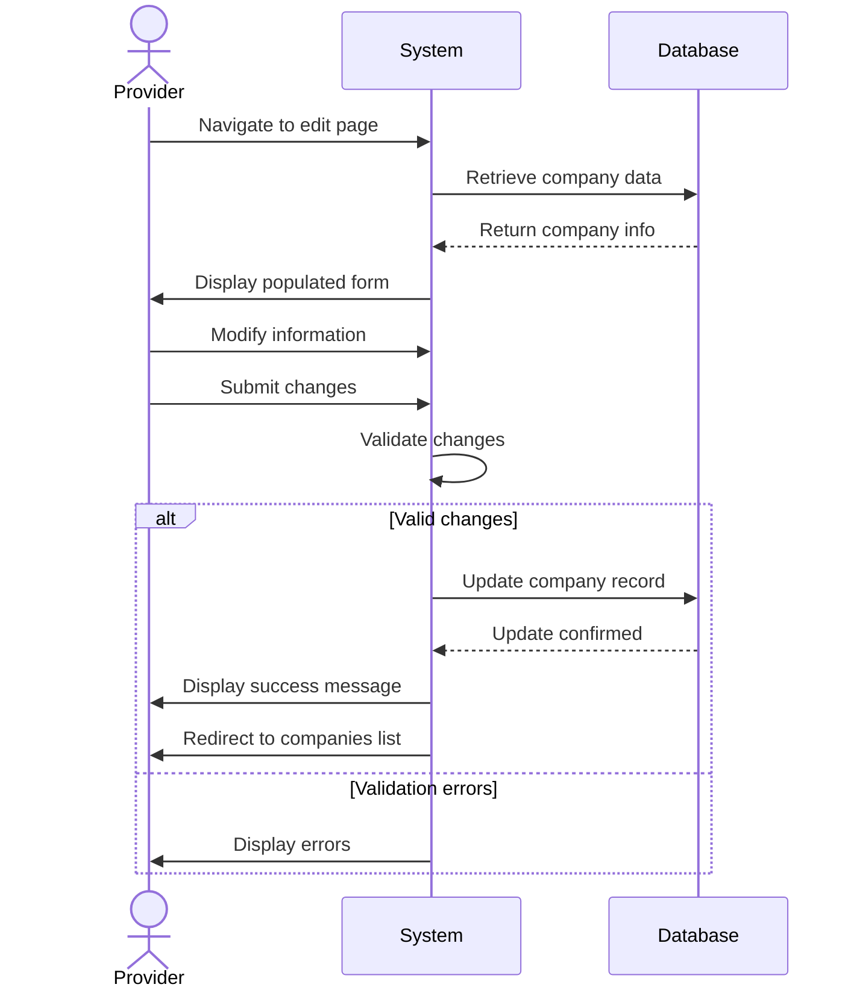
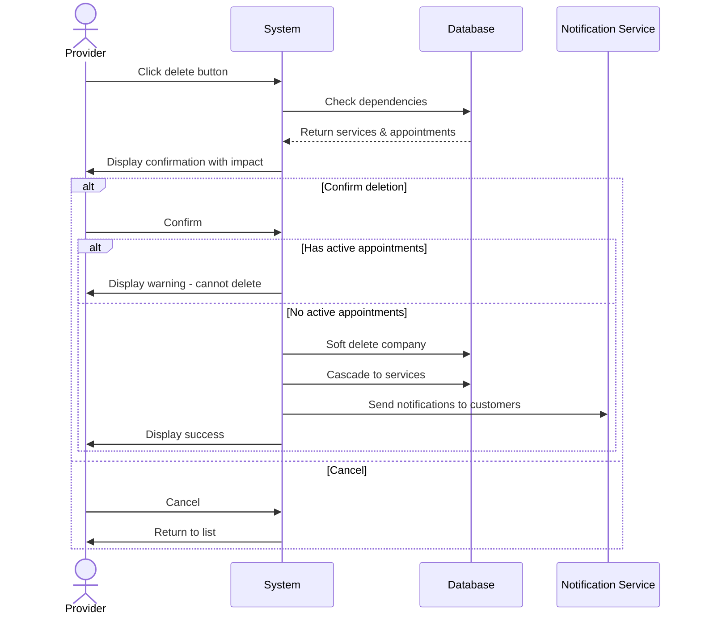

# Company Management Use Cases

## UC-007: View Companies

**Actor**: Provider  
**Preconditions**: Provider is logged in and has completed onboarding  
**Page**: `/provider/companies`

### Diagram

### Main Flow
1. Provider navigates to Companies page
2. System retrieves all companies belonging to the provider
3. System displays companies in a list/grid view with:
   - Company name
   - Company logo
   - Number of services
   - Status (Active/Inactive)
   - Quick action buttons
4. Provider can search/filter companies
5. Provider can sort companies by various criteria

### Alternative Flows
**A1: No Companies Exist**
- System displays empty state
- System shows "Create Company" call-to-action button
- Provider can create first company

**A2: Filter Results**
- Provider applies filters (status, date created, etc.)
- System updates display with filtered results

**A3: Search Companies**
- Provider enters search term
- System displays matching companies

### Postconditions
- Provider views their companies
- Provider can navigate to company details or edit

### Business Rules
- Only owned companies are displayed
- Inactive companies are shown with visual indicator
- List is paginated if more than 20 companies

---

## UC-008: Create Company

**Actor**: Provider  
**Preconditions**: Provider is logged in  
**Page**: `/provider/companies/create`

### Diagram

### Main Flow
1. Provider clicks "Create Company" button
2. System displays company creation form
3. Provider enters company information:
   - Company name (required)
   - Company description
   - Business category
   - Logo upload
   - Contact information
     - Email
     - Phone number
     - Website
   - Address information
     - Street address
     - City
     - State/Province
     - Zip/Postal code
     - Country
   - Business hours
   - Social media links
4. Provider uploads company logo (if available)
5. Provider submits form
6. System validates all required fields
7. System creates company record
8. System displays success message
9. System redirects to company services page

### Alternative Flows
**A1: Missing Required Fields**
- System highlights missing fields
- System displays validation errors
- Provider completes required fields

**A2: Invalid Contact Information**
- System validates email format
- System validates phone number format
- Provider corrects invalid entries

**A3: Logo Upload Failure**
- System displays error message
- Provider can retry upload or continue without logo
- Logo can be added later

**A4: Cancel Creation**
- Provider clicks "Cancel" button
- System shows confirmation dialog
- System discards entered data
- Provider is redirected to companies list

**A5: Save as Draft**
- Provider saves incomplete company
- System stores draft
- Provider can complete later

### Postconditions
- New company is created
- Company is associated with provider
- Provider can add services to company

### Business Rules
- Company name must be unique for the provider
- Maximum logo file size: 5MB
- Accepted image formats: JPG, PNG, SVG
- Minimum required fields: name, category, email
- Provider can create unlimited companies

---

## UC-009: Edit Company

**Actor**: Provider  
**Preconditions**: Provider owns the company  
**Page**: `/provider/companies/:id/edit`

### Diagram

### Main Flow
1. Provider navigates to company edit page
2. System retrieves existing company data
3. System populates form with current information
4. Provider modifies company information
5. Provider submits updated form
6. System validates changes
7. System updates company record
8. System displays success message
9. System redirects to companies list or company details

### Alternative Flows
**A1: No Changes Made**
- Provider clicks save without changes
- System displays "No changes detected" message
- Provider is redirected back

**A2: Validation Errors**
- System highlights invalid fields
- Provider corrects errors
- Provider resubmits

**A3: Concurrent Edit Conflict**
- System detects company was modified by another session
- System displays conflict warning
- Provider can review changes and choose to overwrite or cancel

**A4: Cancel Edit**
- Provider clicks "Cancel"
- System shows confirmation if changes exist
- System discards changes
- Provider is redirected back

### Postconditions
- Company information is updated
- All associated services retain their connection
- Update timestamp is recorded

### Business Rules
- Only company owner can edit
- Company name must remain unique
- Active bookings are not affected by changes
- Logo changes reflect immediately on all pages

---

## UC-010: Delete Company

**Actor**: Provider  
**Preconditions**: Provider owns the company  
**Page**: `/provider/companies`

### Diagram

### Main Flow
1. Provider clicks delete button on company
2. System shows confirmation dialog with warning
3. System displays information about:
   - Number of services associated
   - Number of active appointments
   - Impact of deletion
4. Provider confirms deletion
5. System checks for dependencies
6. System soft-deletes or archives company
7. System displays success message
8. System refreshes companies list

### Alternative Flows
**A1: Company Has Active Appointments**
- System displays warning
- System prevents deletion
- System suggests completing or canceling appointments first

**A2: Company Has Services**
- System warns about service deletion
- Provider confirms deletion of all services
- System cascades soft-delete to services

**A3: Cancel Deletion**
- Provider cancels deletion
- System closes dialog
- No changes are made

**A4: Archive Instead of Delete**
- Provider chooses to archive
- System marks company as inactive
- Company data is preserved but hidden

### Postconditions
- Company is deleted or archived
- Associated services are handled according to cascade rules
- Future appointments are canceled with notifications

### Business Rules
- Cannot delete company with active appointments
- Deleted companies can be restored within 30 days
- After 30 days, deletion becomes permanent
- All customers with bookings are notified
- Historical appointment data is preserved for records

---

*Last updated: March 6, 2026*
