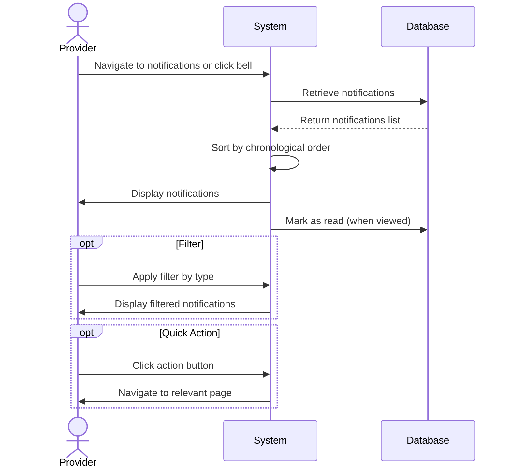
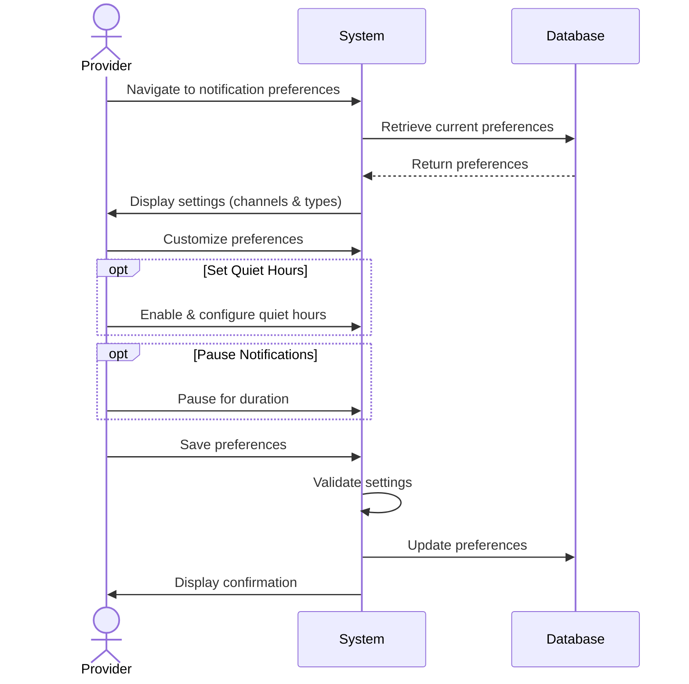
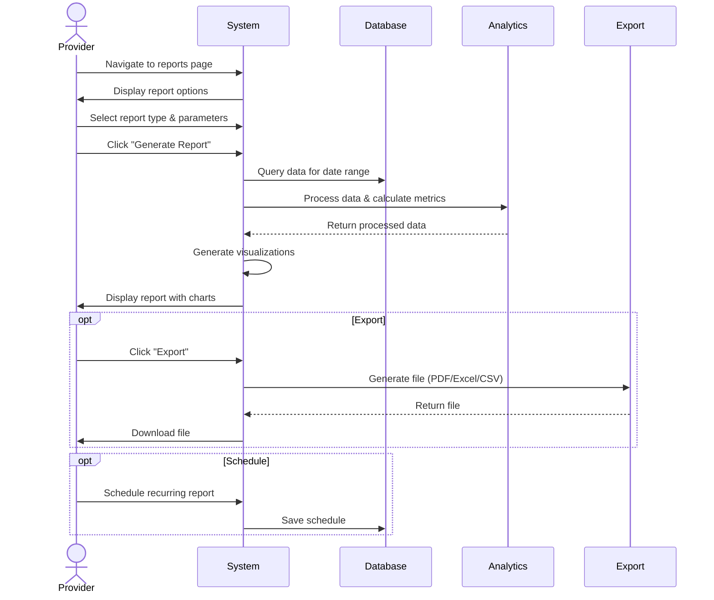
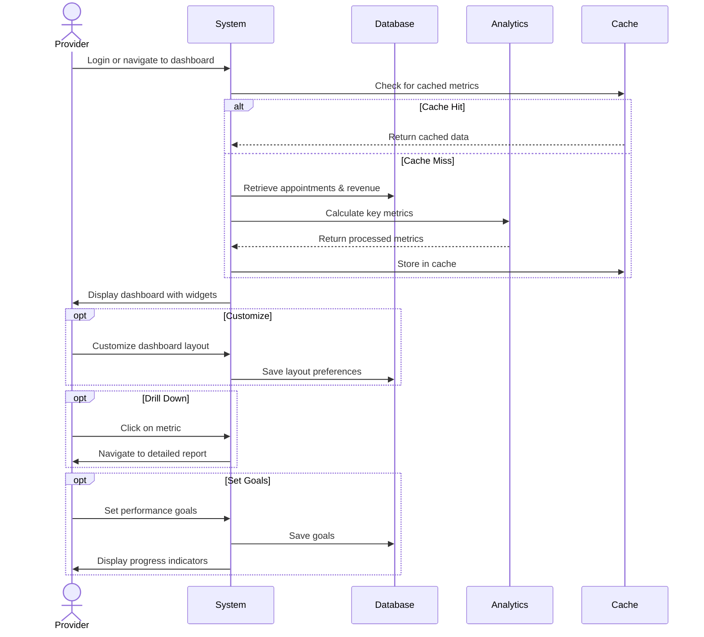

# Notifications & Reports Use Cases

## UC-027: View Notifications

**Actor**: Provider  
**Preconditions**: Provider is logged in  
**Page**: `/provider/notifications`

### Diagram

### Main Flow
1. Provider navigates to notifications page or clicks notification bell
2. System retrieves all notifications for the provider
3. System displays notifications in chronological order:
   - **New Booking Requests**
     - Customer name
     - Service requested
     - Requested date/time
     - Quick action buttons (Accept/Reject)
   - **Booking Confirmations**
     - Confirmed appointment details
     - Customer information
   - **Cancellations**
     - Cancelled appointment info
     - Cancellation reason
     - Refund status
   - **Payment Notifications**
     - Payment received
     - Payout processed
     - Failed payments
   - **Profile Updates**
     - Review received
     - Profile verification status
     - Settings changes
   - **System Notifications**
     - Account updates
     - Policy changes
     - Feature announcements
4. System marks notifications as read when viewed
5. Provider can filter notifications by type
6. Provider can mark all as read
7. Provider can delete notifications

### Alternative Flows
**A1: No Notifications**
- System displays empty state
- System shows helpful message
- System indicates when to expect notifications

**A2: Filter by Type**
- Provider selects notification category
- System displays only selected type
- Unread count updates accordingly

**A3: Filter by Read/Unread**
- Provider toggles read/unread filter
- System displays filtered notifications
- Provider can mark individual items as read/unread

**A4: Quick Actions from Notification**
- Provider clicks action button (e.g., "View Appointment")
- System navigates to relevant page
- Notification is marked as read
- Context is preserved

**A5: Delete Notification**
- Provider clicks delete on notification
- System removes notification from list
- Action cannot be undone
- System notification remains in history

**A6: Search Notifications**
- Provider enters search term
- System searches notification content
- System displays matching results

### Postconditions
- Provider is informed of important events
- Unread count is updated
- Provider can take action on notifiable events

### Business Rules
- Notifications expire after 90 days
- Critical notifications cannot be deleted
- Unread count shows in navigation badge
- Maximum 1000 notifications stored per user
- Older notifications are auto-archived
- Real-time notifications arrive within 30 seconds

---

## UC-028: Manage Notification Preferences

**Actor**: Provider  
**Preconditions**: Provider is logged in  
**Page**: `/provider/settings` (Notifications section)

### Diagram

### Main Flow
1. Provider navigates to notification preferences
2. System displays notification settings organized by:
   - **Notification Channels**
     - In-app notifications (on/off)
     - Email notifications (on/off)
     - SMS notifications (on/off)
     - Push notifications (on/off)
   - **Notification Types**
     - New booking requests
     - Booking confirmations
     - Cancellations
     - Reschedule requests
     - Payments
     - Reviews
     - Messages from customers
     - System updates
     - Marketing communications
   - **Frequency Settings**
     - Instant (real-time)
     - Digest (daily summary)
     - Digest (weekly summary)
     - Critical only
3. Provider customizes preferences per type and channel
4. Provider sets quiet hours (optional)
5. Provider saves preferences
6. System validates settings
7. System applies notification rules
8. System displays confirmation

### Alternative Flows
**A1: Configure Quiet Hours**
- Provider enables "Quiet Hours"
- Provider sets start time (e.g., 10 PM)
- Provider sets end time (e.g., 7 AM)
- Provider selects days to apply
- System suppresses non-critical notifications during hours

**A2: Custom Notification Sounds**
- Provider clicks "Customize Sounds"
- System shows sound options
- Provider tests sounds
- Provider selects preferred sounds per type
- System saves sound preferences

**A3: Channel-Specific Settings**
- Provider configures email preferences:
  - HTML vs plain text
  - Email frequency
  - Batch similar notifications
- Provider configures SMS preferences:
  - Phone number
  - Critical only option

**A4: Temporary Pause**
- Provider clicks "Pause Notifications"
- Provider selects pause duration (1 hour to 1 week)
- System pauses non-critical notifications
- System resumes after duration

**A5: Use Template**
- Provider selects preset template:
  - "Always On" (all notifications)
  - "Business Hours Only"
  - "Critical Only"
  - "Custom"
- System applies template settings
- Provider can further customize

### Postconditions
- Notification preferences are saved
- Provider receives notifications per preferences
- System respects quiet hours and channel choices
- Spam is minimized

### Business Rules
- Critical notifications (booking within 2 hours) always notify
- Minimum one notification channel must be active
- SMS notifications may incur charges
- Quiet hours don't apply to emergencies
- Marketing communications can always be disabled
- Some legal/compliance notifications are mandatory

---

## UC-029: Generate Reports

**Actor**: Provider  
**Preconditions**: Provider is logged in and has booking history  
**Page**: `/provider/reports`

### Diagram

### Main Flow
1. Provider navigates to reports page
2. System displays report options dashboard
3. Provider selects report type:
   - **Financial Reports**
     - Revenue summary
     - Payment history
     - Refunds and cancellations
     - Outstanding payments
   - **Booking Reports**
     - Appointments summary
     - Completion rate
     - No-show rate
     - Popular services
   - **Customer Reports**
     - New vs returning customers
     - Customer demographics
     - Customer retention
     - Top customers
   - **Performance Reports**
     - Rating trends
     - Review analysis
     - Response time metrics
     - Utilization rate
   - **Time Reports**
     - Hours worked
     - Peak booking times
     - Seasonal trends
     - Availability utilization
4. Provider configures report parameters:
   - Date range (start and end date)
   - Filters (company, service, status)
   - Grouping (daily, weekly, monthly)
   - Comparison period (optional)
5. Provider clicks "Generate Report"
6. System processes data
7. System displays report with:
   - Summary statistics
   - Charts and visualizations
   - Detailed data tables
   - Trend analysis
8. Provider can export or share report

### Alternative Flows
**A1: Export Report**
- Provider clicks "Export" button
- System offers export formats:
  - PDF (for printing/sharing)
  - Excel/CSV (for analysis)
  - JSON (for integration)
- Provider selects format
- System generates download
- Provider receives file

**A2: Schedule Recurring Report**
- Provider clicks "Schedule Report"
- Provider configures:
  - Report type
  - Frequency (daily, weekly, monthly)
  - Delivery method (email, download)
  - Recipients
- System saves schedule
- System automatically generates and sends reports

**A3: Compare Periods**
- Provider enables "Compare with Previous Period"
- System adds comparison data
- Charts show comparison trends
- Percent changes are highlighted

**A4: Custom Report**
- Provider clicks "Custom Report Builder"
- Provider selects:
  - Data fields to include
  - Metrics to calculate
  - Grouping and sorting
  - Visualizations
- System generates custom report
- Provider can save as template

**A5: Insufficient Data**
- System detects insufficient data for report
- System displays message
- System suggests expanding date range
- System shows what data is available

**A6: Share Report**
- Provider clicks "Share"
- System generates shareable link
- Provider can set permissions
- Provider can add collaborators
- Recipients can view but not edit

### Postconditions
- Report is generated and displayed
- Provider has insights into business performance
- Data can be exported for further analysis
- Scheduled reports are queued for delivery

### Business Rules
- Historical data limited to account age
- Real-time data may have 15-minute delay
- Financial reports include tax information
- Custom reports limited to 10 saved templates
- Scheduled reports send at configured time
- Export file size limited to 50MB
- Sensitive data is redacted in shared reports

---

## UC-030: View Analytics Dashboard

**Actor**: Provider  
**Preconditions**: Provider is logged in  
**Page**: `/provider` (Dashboard)

### Diagram

### Main Flow
1. Provider logs in or navigates to dashboard
2. System retrieves provider's key metrics
3. System displays analytics dashboard with:
   - **Overview Cards**
     - Total bookings (today, this week, this month)
     - Revenue summary
     - Pending requests
     - Average rating
   - **Calendar Preview**
     - Today's appointments
     - Upcoming appointments
     - Available slots
   - **Performance Metrics**
     - Booking trend chart
     - Revenue trend chart
     - Customer satisfaction graph
   - **Quick Stats**
     - New customers this month
     - Repeat customer rate
     - Cancellation rate
     - Average booking value
   - **Recent Activity**
     - Latest bookings
     - Recent reviews
     - Recent notifications
   - **Quick Actions**
     - View all appointments
     - Create new company
     - Manage services
     - View reports
4. Provider can interact with dashboard elements
5. Provider can click through to detailed views
6. Provider can refresh data

### Alternative Flows
**A1: Customize Dashboard**
- Provider clicks "Customize Dashboard"
- System shows widget options
- Provider selects which widgets to display
- Provider arranges widget layout (drag & drop)
- Provider saves custom layout
- System applies custom dashboard

**A2: Filter by Date Range**
- Provider selects date range filter
- System updates all metrics for range
- Charts and graphs adjust accordingly
- Comparison to previous period shown

**A3: Filter by Company/Service**
- Provider selects company or service filter
- System displays metrics for selection only
- All widgets reflect filtered data

**A4: Drill Down into Metric**
- Provider clicks on metric card
- System navigates to detailed report
- Full data table is displayed
- Additional analysis options available

**A5: Export Dashboard**
- Provider clicks "Export Dashboard"
- System generates PDF snapshot
- Dashboard is formatted for printing
- Provider receives download

**A6: Set Goals**
- Provider clicks "Set Goals"
- Provider enters targets:
  - Monthly booking target
  - Revenue goal
  - Rating goal
- System tracks progress
- Dashboard shows progress indicators

### Postconditions
- Provider has comprehensive business overview
- Provider can make data-driven decisions
- Important metrics are immediately visible
- Provider can access detailed information as needed

### Business Rules
- Dashboard updates every 5 minutes
- Data accuracy: 99.9%
- Metrics calculated on trailing periods
- Currency displays in provider's configured currency
- Timezone matches provider's settings
- Historical comparisons show percent change
- Widgets can be hidden but not removed completely

---

*Last updated: March 6, 2026*
