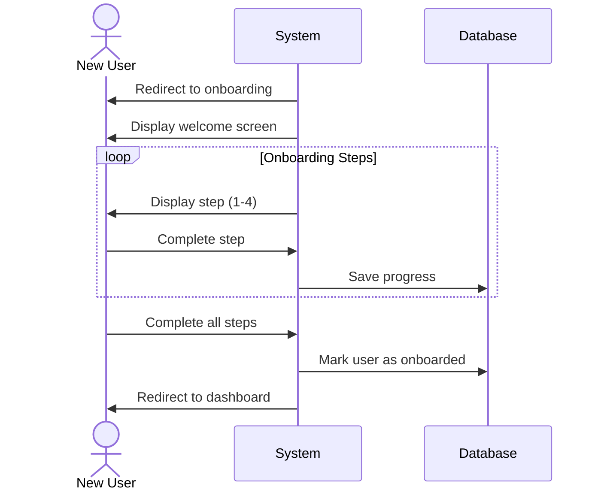
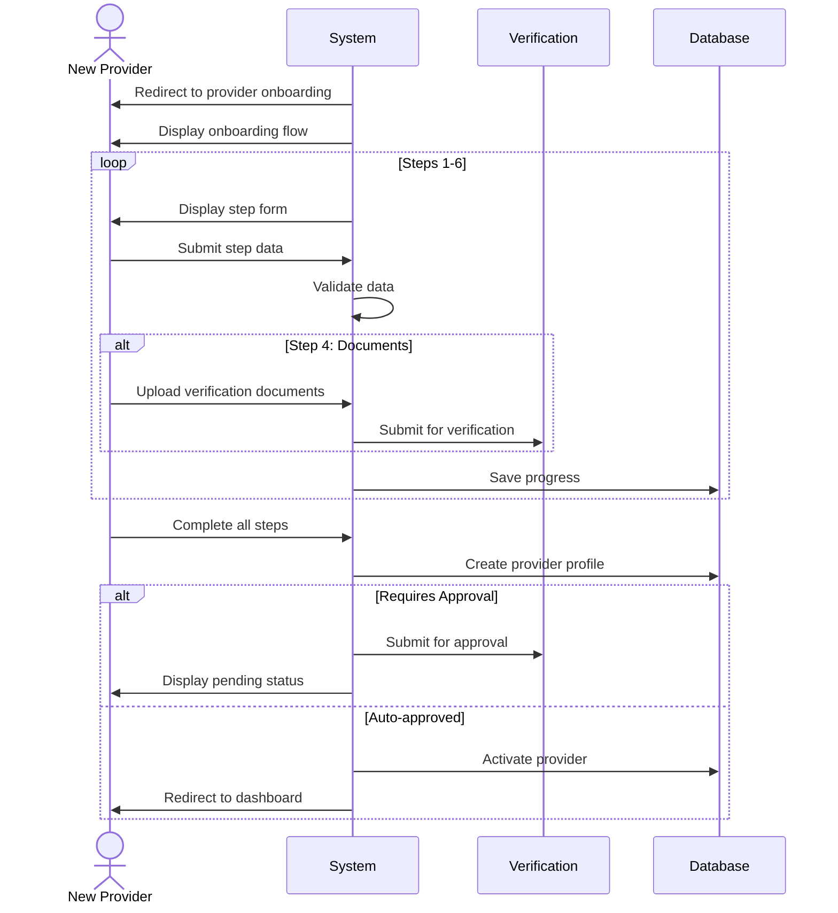

# Onboarding Use Cases

## UC-005: General User Onboarding

**Actor**: New User  
**Preconditions**: User has just registered but not completed onboarding  
**Page**: `/onboarding`

### Diagram

### Main Flow
1. System redirects newly registered user to onboarding page
2. System displays welcome screen with app introduction
3. User proceeds through onboarding steps:
   - **Step 1**: Personal information completion
   - **Step 2**: Preferences setup (notifications, language, etc.)
   - **Step 3**: Tutorial/Feature overview
   - **Step 4**: Confirmation and completion
4. User completes each step
5. System saves onboarding preferences
6. System marks user as onboarded
7. System redirects to main application dashboard

### Alternative Flows
**A1: Skip Onboarding**
- User clicks "Skip" button
- System shows confirmation dialog
- System marks partial onboarding completion
- User is redirected to dashboard with tutorial hints enabled

**A2: Exit During Onboarding**
- User closes or navigates away
- System saves progress
- System shows onboarding prompt on next login

**A3: Back Navigation**
- User clicks "Back" button
- System returns to previous onboarding step
- Previously entered data is preserved

### Postconditions
- User profile is complete
- User preferences are configured
- User is familiar with basic features
- User can access full application

### Business Rules
- Onboarding can be completed later
- Users can skip non-mandatory steps
- Onboarding progress is saved automatically
- Tutorial can be accessed later from help menu

---

## UC-006: Provider Onboarding

**Actor**: New Provider  
**Preconditions**: User has registered with Provider role  
**Page**: `/onboarding-provider`

### Diagram

### Main Flow
1. System redirects newly registered provider to provider onboarding
2. System displays provider-specific onboarding flow
3. Provider completes onboarding steps:
   - **Step 1**: Business information
     - Business name
     - Business type
     - Business description
     - Contact information
   - **Step 2**: Service area and location
     - Physical address
     - Service areas
     - Operating regions
   - **Step 3**: Business hours setup
     - Regular working hours
     - Days of operation
     - Time zones
   - **Step 4**: Verification documents
     - Business license (if applicable)
     - Identification documents
     - Certifications
   - **Step 5**: Payment setup
     - Bank account information
     - Payment preferences
     - Pricing structure
   - **Step 6**: Service setup (initial)
     - Create first service/offering
     - Set pricing and duration
4. Provider completes all steps
5. System validates all information
6. System submits provider profile for approval (if required)
7. System displays completion message
8. System redirects to provider dashboard

### Alternative Flows
**A1: Incomplete Verification Documents**
- System marks provider as "Pending Verification"
- Provider can use limited features
- System sends reminder to complete verification

**A2: Save and Continue Later**
- Provider saves progress
- System marks completion percentage
- Provider can resume from saved step

**A3: Verification Rejected**
- System notifies provider of rejection
- System displays rejection reasons
- Provider can resubmit documents

**A4: Skip Optional Steps**
- Provider skips non-critical steps
- System marks for later completion
- Provider can access these from settings

### Postconditions
- Provider profile is created and complete
- Provider business information is stored
- Provider can create companies and services
- Provider account is active or pending approval

### Business Rules
- Business information is mandatory
- Document verification may be required based on business type
- First service creation is optional during onboarding
- Provider must complete onboarding to accept bookings
- Approval process may take 24-48 hours

---

*Last updated: March 6, 2026*
