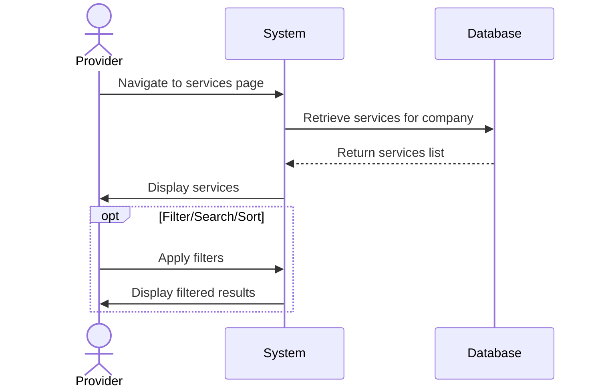
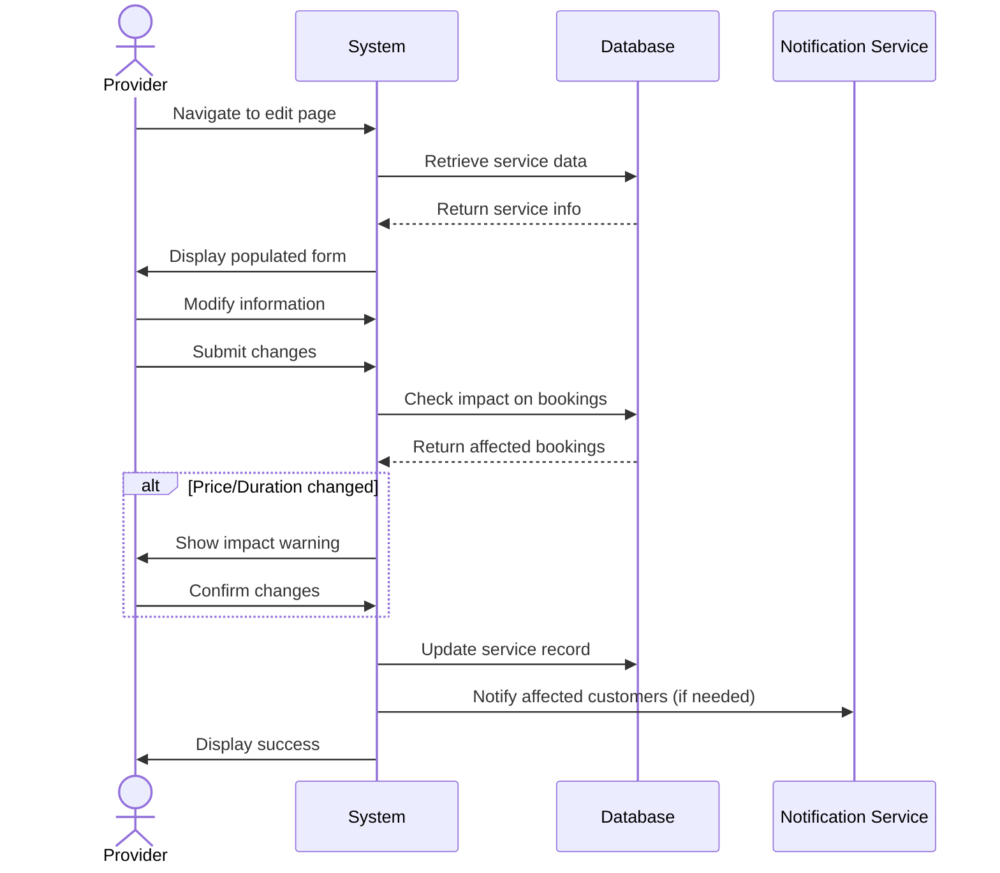
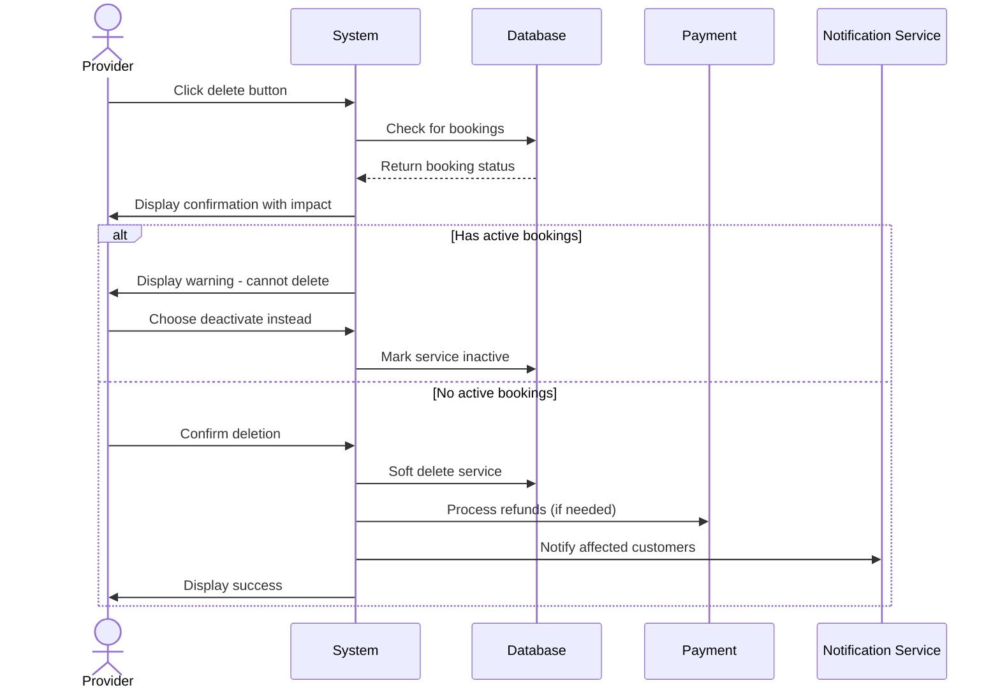

```mermaid
sequenceDiagram
    actor Provider
    participant System
    participant Storage
    participant DB as Database
    
    Provider->>System: Click "Create Service"
    System->>Provider: Display service form
    Provider->>System: Enter service details
    opt Upload Images
        Provider->>System: Upload service images
        System->>Storage: Store images
        Storage-->>System: Return image URLs
    end
    Provider->>System: Submit form
    System->>System: Validate fields
    alt Valid data
        System->>DB: Create service record
        System->>DB: Link to company
        DB-->>System: Service created
        System->>Provider: Display success
        System->>Provider: Redirect to services list
    else Invalid data
        System->>Provider: Display validation errors
    end
```

# Service Management Use Cases

## UC-011: View Services

**Actor**: Provider  
**Preconditions**: Provider is logged in and has at least one company  
**Page**: `/provider/companies/:id/services`

### Diagram

### Main Flow
1. Provider navigates to services page for a specific company
2. System retrieves all services for the selected company
3. System displays services in list/grid format with:
   - Service name
   - Service description (truncated)
   - Duration
   - Price
   - Status (Active/Inactive)
   - Number of bookings
   - Quick action buttons (Edit, Deactivate, Delete)
4. Provider can view service details
5. Provider can perform quick actions on services

### Alternative Flows
**A1: No Services Exist**
- System displays empty state message
- System shows "Create First Service" call-to-action
- Provider can create initial service

**A2: Filter Services**
- Provider applies filters (status, price range, duration)
- System displays filtered results

**A3: Search Services**
- Provider enters search term
- System searches by service name and description
- System displays matching services

**A4: Sort Services**
- Provider selects sort criteria (name, price, date created)
- System reorders services accordingly

### Postconditions
- Provider views all company services
- Provider can manage services

### Business Rules
- Only services for the selected company are shown
- Inactive services are visually distinguished
- List is paginated if more than 20 services

---

## UC-012: Create Service

**Actor**: Provider  
**Preconditions**: Provider has at least one company  
**Page**: `/provider/companies/:id/services/create`

### Diagram

### Main Flow
1. Provider clicks "Create Service" button
2. System displays service creation form
3. Provider enters service information:
   - Service name (required)
   - Service description (required)
   - Category/Type
   - Duration (required)
     - Hours
     - Minutes
   - Pricing (required)
     - Base price
     - Currency
     - Pricing type (Fixed/Hourly/Custom)
   - Advanced settings
     - Buffer time before/after
     - Advance booking period
     - Cancellation policy
     - Maximum bookings per day
     - Booking requirements/instructions
   - Service images/gallery
   - Availability
     - Specific days
     - Time slots
4. Provider uploads service images (optional)
5. Provider submits form
6. System validates all required fields
7. System creates service record
8. System links service to company
9. System displays success message
10. System redirects to services list

### Alternative Flows
**A1: Missing Required Fields**
- System highlights missing fields with error messages
- Provider completes required information
- Provider resubmits

**A2: Invalid Duration**
- System validates duration is positive
- System enforces minimum duration (e.g., 15 minutes)
- Provider enters valid duration

**A3: Invalid Pricing**
- System validates price is positive
- System validates currency format
- Provider corrects pricing

**A4: Image Upload Failure**
- System displays error message
- Provider can retry or skip images
- Images can be added later

**A5: Cancel Creation**
- Provider clicks "Cancel"
- System shows confirmation dialog
- System discards entered data
- Provider is redirected back

**A6: Save as Draft**
- Provider saves incomplete service
- System stores draft with status "Inactive"
- Provider can complete and activate later

### Postconditions
- New service is created and linked to company
- Service is available for booking (if activated)
- Service appears in company's service list

### Business Rules
- Service name must be unique within the company
- Duration must be between 15 minutes and 24 hours
- Price must be positive
- Maximum 10 images per service
- Image size limit: 5MB per image
- Buffer time cannot exceed service duration
- Advance booking period: 1 hour to 365 days

---

## UC-013: Edit Service

**Actor**: Provider  
**Preconditions**: Provider owns the company and service  
**Page**: `/provider/companies/:id/services/edit` or inline edit

### Diagram

### Main Flow
1. Provider navigates to service edit page or clicks edit button
2. System retrieves existing service data
3. System populates form with current information
4. Provider modifies service information
5. Provider submits updated form
6. System validates changes
7. System checks impact on existing bookings
8. System updates service record
9. System displays success message
10. System updates all affected future bookings (if necessary)
11. System redirects to services list

### Alternative Flows
**A1: Price Changed with Existing Bookings**
- System shows warning about future bookings
- System offers options:
  - Apply to new bookings only
  - Apply to all future bookings
  - Honor old price for existing bookings
- Provider selects option
- System applies changes accordingly

**A2: Duration Changed**
- System checks for scheduling conflicts
- System displays affected appointments
- Provider confirms changes
- System adjusts appointment slots

**A3: No Changes Made**
- Provider clicks save without changes
- System displays "No changes detected"
- Provider is redirected back

**A4: Validation Errors**
- System highlights invalid fields
- Provider corrects errors
- Provider resubmits

**A5: Cancel Edit**
- Provider clicks "Cancel"
- System shows confirmation if changes exist
- System discards changes
- Provider is redirected back

### Postconditions
- Service information is updated
- Future bookings reflect changes
- Service update history is logged

### Business Rules
- Price changes don't affect past appointments
- Duration changes may require appointment adjustments
- Customers are notified of significant changes
- Old pricing honored for confirmed bookings unless specified

---

## UC-014: Delete Service

**Actor**: Provider  
**Preconditions**: Provider owns the company and service  
**Page**: `/provider/companies/:id/services`

### Diagram

### Main Flow
1. Provider clicks delete button on service
2. System displays confirmation dialog with warning
3. System shows impact information:
   - Number of active bookings
   - Future scheduled appointments
   - Total revenue at risk
4. Provider confirms deletion
5. System checks for active bookings
6. System soft-deletes or deactivates service
7. System handles existing bookings per policy
8. System displays success message
9. System refreshes services list

### Alternative Flows
**A1: Service Has Active Bookings**
- System prevents immediate deletion
- System offers options:
  - Complete active bookings then delete
  - Cancel all bookings and delete
  - Deactivate instead of delete
- Provider chooses option
- System processes accordingly

**A2: Service Has Future Bookings**
- System displays list of future bookings
- System sends cancellation notices to customers
- System processes refunds (if applicable)
- System completes deletion

**A3: Cancel Deletion**
- Provider cancels deletion
- System closes dialog
- No changes are made

**A4: Deactivate Instead**
- Provider chooses to deactivate
- System marks service as inactive
- Service stops accepting new bookings
- Existing bookings continue

### Postconditions
- Service is deleted or deactivated
- Customers with future bookings are notified
- Service no longer appears in public listings
- Historical data is preserved

### Business Rules
- Cannot delete service with active (ongoing) appointments
- Services with future bookings require confirmation
- Deleted services can be restored within 30 days
- After 30 days, deletion becomes permanent
- All affected customers receive notifications
- Refund policy is applied automatically
- Historical booking data is preserved for reporting

---

*Last updated: March 6, 2026*
