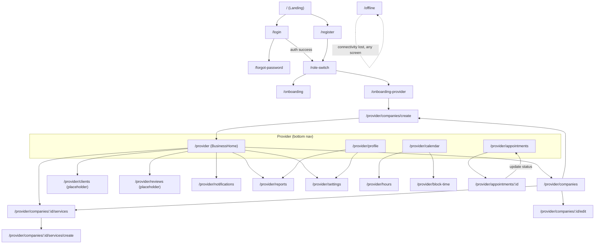

# Bookas – Use Cases (Frontend)

This file lists the frontend use cases and maps them to the BookPro API use cases where applicable. Missing API support is noted so implementation can be prioritized.

## Mapping notes

- Where an API UC exists we map to `API UC-##` and include the route.
- Items marked `[NO API YET]` indicate frontend features that have no direct backend endpoint today.
- Items marked `[NOT IMPLEMENTED]` indicate use cases with no screen/route built yet in `src/app` (as of this update, only the **provider** side is implemented — no customer-facing booking screens exist).
- Route column reflects the actual routes defined in [routes.tsx](../../src/app/routes.tsx).

## Screens (implemented)

Public:

| Screen          | Route              | Component                                                             |
| --------------- | ------------------ | --------------------------------------------------------------------- |
| Landing         | `/`                | [Landing.tsx](../../src/app/screens/public/Landing.tsx)               |
| Login           | `/login`           | [Login.tsx](../../src/app/screens/public/Login.tsx)                   |
| Register        | `/register`        | [Register.tsx](../../src/app/screens/public/Register.tsx)             |
| Forgot Password | `/forgot-password` | [ForgotPassword.tsx](../../src/app/screens/public/ForgotPassword.tsx) |

Extra:

| Screen              | Route                  | Component                                                                       |
| ------------------- | ---------------------- | ------------------------------------------------------------------------------- |
| Onboarding          | `/onboarding`          | [Onboarding.tsx](../../src/app/screens/extra/Onboarding.tsx)                    |
| Provider Onboarding | `/onboarding-provider` | [ProviderOnboarding.tsx](../../src/app/screens/provider/ProviderOnboarding.tsx) |
| Role Switch Landing | `/role-switch`         | [RoleSwitchLanding.tsx](../../src/app/screens/extra/RoleSwitchLanding.tsx)      |
| Offline             | `/offline`             | [Offline.tsx](../../src/app/screens/extra/Offline.tsx)                          |

Provider (wrapped in [ProviderLayout.tsx](../../src/app/layouts/ProviderLayout.tsx)):

| Screen                | Route                                     | Component                                                                                     |
| --------------------- | ----------------------------------------- | --------------------------------------------------------------------------------------------- |
| Business Home         | `/provider`                               | [BusinessHome.tsx](../../src/app/screens/provider/BusinessHome.tsx)                           |
| Companies             | `/provider/companies`                     | [Companies.tsx](../../src/app/screens/provider/Companies.tsx)                                 |
| Create Company        | `/provider/companies/create`              | [CreateCompany.tsx](../../src/app/screens/provider/CreateCompany.tsx)                         |
| Edit Company          | `/provider/companies/:id/edit`            | [CreateCompany.tsx](../../src/app/screens/provider/CreateCompany.tsx)                         |
| Services              | `/provider/companies/:id/services`        | [Services.tsx](../../src/app/screens/provider/Services.tsx)                                   |
| Create Service        | `/provider/companies/:id/services/create` | [CreateService.tsx](../../src/app/screens/provider/CreateService.tsx)                         |
| Clients (placeholder) | `/provider/clients`                       | [Companies.tsx](../../src/app/screens/provider/Companies.tsx)                                 |
| Appointments          | `/provider/appointments`                  | [ProviderAppointments.tsx](../../src/app/screens/provider/ProviderAppointments.tsx)           |
| Appointment Detail    | `/provider/appointments/:id`              | [ProviderAppointmentDetail.tsx](../../src/app/screens/provider/ProviderAppointmentDetail.tsx) |
| Calendar              | `/provider/calendar`                      | [Calendar.tsx](../../src/app/screens/provider/Calendar.tsx)                                   |
| Hours                 | `/provider/hours`                         | [Hours.tsx](../../src/app/screens/provider/Hours.tsx)                                         |
| Block Time            | `/provider/block-time`                    | [BlockTime.tsx](../../src/app/screens/provider/BlockTime.tsx)                                 |
| Notifications         | `/provider/notifications`                 | [Notifications.tsx](../../src/app/screens/provider/Notifications.tsx)                         |
| Profile               | `/provider/profile`                       | [ProviderProfile.tsx](../../src/app/screens/provider/ProviderProfile.tsx)                     |
| Settings              | `/provider/settings`                      | [ProviderSettings.tsx](../../src/app/screens/provider/ProviderSettings.tsx)                   |
| Reports               | `/provider/reports`                       | [Reports.tsx](../../src/app/screens/provider/Reports.tsx)                                     |
| Reviews (placeholder) | `/provider/reviews`                       | [Reports.tsx](../../src/app/screens/provider/Reports.tsx)                                     |

Not yet implemented: customer-facing screens (company/service search, available slots, booking, my appointments, payments).

## 1. Onboarding

- UC-001: User Registration → `/register` → API UC-01 (`POST /api/v1/accounts/register`)
- UC-002: User Login → `/login` → API UC-02 (`POST /api/v1/accounts/login`)
- UC-003: Google Login → API UC-03 (`POST /api/v1/accounts/google-login`) — [NOT IMPLEMENTED] add if providing social auth
- UC-004: Password Recovery → `/forgot-password` → API UC-04 / UC-05 (`POST /api/v1/accounts/forgot-password`, `POST /api/v1/accounts/reset-password`)
- UC-005: Generic Onboarding (intro/carousel) → `/onboarding`
- UC-005b: Role Switch Landing → `/role-switch`
- UC-005c: Provider Onboarding (minimum info) → `/onboarding-provider`, uses `Create Company` + `Add Service` flows (see below)
- UC-005d: Offline state screen → `/offline`

## 2. Profile

- UC-006: View Provider Profile → `/provider/profile` → API UC-06 (`GET /api/v1/users/profile`)
- UC-007: Edit Provider Profile → `/provider/profile` → API UC-08 (`PUT /api/v1/users/profile`)

## 3. Company (Provider)

- UC-008: Create Company → `/provider/companies/create` → API UC-09 (`POST /api/v1/companies`)
- UC-009: View Companies → `/provider/companies` → API UC-10 (`GET /api/v1/companies`)
- UC-010: Edit Company → `/provider/companies/:id/edit` → API UC-13 (`PUT /api/v1/companies/{id}`)
- UC-011: Delete Company → [NO API YET] (consider restricting or implementing)
- UC-012: Search Companies → [NOT IMPLEMENTED] → API UC-14 (`GET /api/v1/companies/search`)

## 4. Services (Offerings)

- UC-013: View Services → `/provider/companies/:id/services` → API UC-22 (`GET /api/v1/companies/{companyId}/services`)
- UC-014: Create Service → `/provider/companies/:id/services/create` → API UC-21 (`POST /api/v1/companies/{companyId}/services`)
- UC-015: Edit Service → [NOT IMPLEMENTED] (no dedicated edit route yet) → API UC-23 (`PUT /api/v1/companies/{companyId}/services/{serviceId}`)
- UC-016: Delete Service → [NOT IMPLEMENTED] → API UC-24 (`DELETE /api/v1/companies/{companyId}/services/{serviceId}`)

## 5. Calendar (Frontend-first; limited API support)

- UC-017: View Calendar → `/provider/calendar` → [FRONTEND]
- UC-018: Configure Working Hours → `/provider/hours` → [NO API YET]
- UC-019: Block Time Slots → `/provider/block-time` → [NO API YET]
- UC-020: Unblock Time Slots → [NO API YET] (managed within Block Time screen)

Note: Calendar features are primarily UI/UX and will require new backend endpoints or a document store if provider-side scheduling is to be persisted.

## 6. Appointments — Customer flows

- UC-021: Get Available Slots → [NOT IMPLEMENTED] → API UC-15 (`GET /api/v1/companies/{companyId}/available-slots`)
- UC-022: Book an Appointment → [NOT IMPLEMENTED] → API UC-25 (`POST /api/v1/appointments`)
- UC-023: View My Appointments → [NOT IMPLEMENTED] → API UC-26 (`GET /api/v1/appointments`)
- UC-024: Get Appointment Details → [NOT IMPLEMENTED] → API UC-27 (`GET /api/v1/appointments/{id}`)
- UC-025: Update/Reschedule Appointment → [NOT IMPLEMENTED] → API UC-28 (`PUT /api/v1/appointments/{id}`)
- UC-026: Cancel Appointment → [NOT IMPLEMENTED] → API UC-29 (`PUT /api/v1/appointments/{id}/cancel`)
- UC-027: Delete Appointment → [NOT IMPLEMENTED] → API UC-30 (`DELETE /api/v1/appointments/{id}`)
- UC-028: Upcoming Appointments view → [NOT IMPLEMENTED] → API UC-32 (`GET /api/v1/appointments/upcoming`)
- UC-029: Appointment History → [NOT IMPLEMENTED] → API UC-33 (`GET /api/v1/appointments/history`)

Note: No customer-facing screens exist yet under `src/app/screens` — only public auth screens (Landing, Login, Register, ForgotPassword) and provider screens are implemented. All customer booking UCs above still need screens/routes.

## 7. Appointments — Provider flows

- UC-030: View Appointments as Provider → `/provider/appointments` → API UC-34 (`GET /api/v1/appointments/as-provider`)
- UC-030b: View Appointment Detail as Provider → `/provider/appointments/:id`
- UC-031: Update Appointment Status (Accept/Confirm/Reject) → `/provider/appointments/:id` → API UC-31 (`PUT /api/v1/appointments/{id}/status`)

Mapping note: combine "accept" and "reject" into the `Update Appointment Status` flow to avoid duplicate UCs.

## 8. Payments (Important — add to frontend)

- UC-032: Process Payment → [NOT IMPLEMENTED] → API UC-35 (`POST /api/v1/payments/process`)
- UC-033: Get Payment Status → [NOT IMPLEMENTED] → API UC-36 (`GET /api/v1/payments/{id}/status`)
- UC-034: Refund Payment → [NOT IMPLEMENTED] → API UC-37 (`POST /api/v1/payments/{paymentId}/refund`)
- UC-035: Payment History → [NOT IMPLEMENTED] → API UC-38 (`GET /api/v1/payments/history`)
- UC-036: Add/View Payment Methods → [NOT IMPLEMENTED] → API UC-39 / UC-40 (`POST/GET /api/v1/payments/methods/{userId}`)

Note: Payments are defined on the API but have no screens implemented yet — add them to the checkout flow.

## 9. Notifications & Settings

- UC-037: View Notifications → `/provider/notifications` → [NO API YET]
- UC-038: Manage Settings → `/provider/settings` → [NO API YET]
- UC-039: Manage Notification Preferences → [NO API YET] (managed within Notifications/Settings screens)

## 10. Analytics & Reports

- UC-040: View Analytics Dashboard → `/provider/reports` → [NO API YET]
- UC-041: Generate Reports → `/provider/reports` → [NO API YET]

## 11. Placeholders (routed but reusing another screen)

- Clients list (`/provider/clients`) currently renders the Companies screen as a placeholder pending a dedicated Clients screen.
- Reviews (`/provider/reviews`) currently renders the Reports screen as a placeholder pending a dedicated Reviews screen.

---

## Frontend sequencing recommendation (minimal provider onboarding)

1. Sign up / Login
2. Create Company (basic details)
3. Add one Service (name, duration, price)
4. Configure simple availability (quick UI) — if backend missing, use client-side defaults
5. Publish booking link and create first example appointment (onboarding demo)
6. Add payment method (optional)

This sequence reduces friction while showing value quickly.

---

## Screen navigation diagram

Diagram reflects the routes actually registered in [routes.tsx](../../src/app/routes.tsx). All `/provider/*` screens share the `ProviderLayout` (bottom nav: Home, Calendar, Appointments, Profile).

Notes:

- Customer-facing booking screens (search company, view slots, book/cancel appointment) do not exist yet; the diagram only covers public auth and provider screens.
- `clients` and `reviews` routes are placeholders that currently render the Companies and Reports screens respectively.
