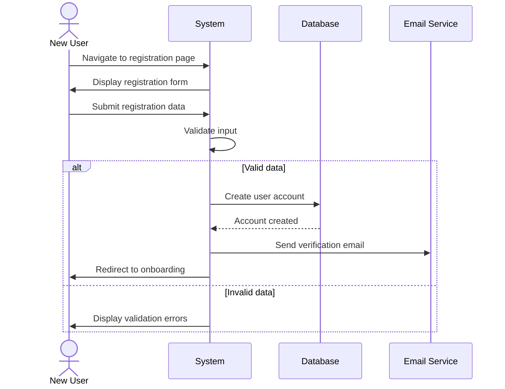

## UC-001: User Registration

**Actor**: New User  
**Preconditions**: User is not registered in the system  
**Page**: `/register`

### Diagram

### Main Flow
1. User navigates to the registration page
2. System displays registration form
3. User enters required information:
   - Full name
   - Email address
   - Password
   - Password confirmation
   - User type selection (Customer/Provider)
4. User submits the registration form
5. System validates the input data
6. System creates new user account
7. System sends verification email (if applicable)
8. System redirects to onboarding page

### Alternative Flows
**A1: Invalid Email Format**
- System displays error message
- User corrects email and resubmits

**A2: Email Already Exists**
- System displays "Email already registered" message
- System offers to redirect to login page

**A3: Password Mismatch**
- System displays "Passwords don't match" error
- User re-enters passwords

**A4: Weak Password**
- System displays password requirements
- User enters stronger password

### Postconditions
- New user account is created in the system
- User is redirected to appropriate onboarding flow

### Business Rules
- Email must be unique in the system
- Password must meet security requirements (minimum length, complexity)
- All required fields must be filled
