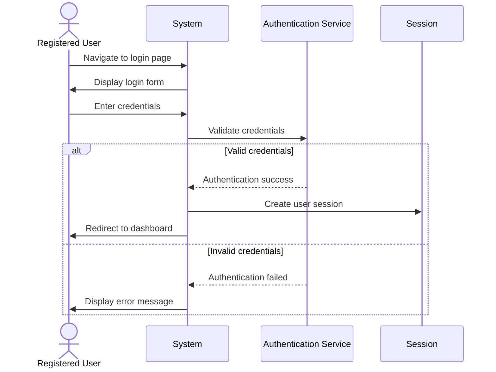

## UC-002: User Login

**Actor**: Registered User  
**Preconditions**: User has a valid account  
**Page**: `/login`

### Diagram

### Main Flow
1. User navigates to login page
2. System displays login form
3. User enters credentials:
   - Email address
   - Password
4. User clicks "Login" button
5. System validates credentials
6. System creates user session
7. System redirects to appropriate dashboard based on user role

### Alternative Flows
**A1: Invalid Credentials**
- System displays "Invalid email or password" message
- User can retry login

**A2: Account Not Verified**
- System displays "Please verify your email" message
- System offers to resend verification email

**A3: Account Locked**
- System displays "Account temporarily locked" message
- System shows when account will be unlocked

**A4: Remember Me Option**
- User selects "Remember Me" checkbox
- System extends session duration

### Postconditions
- User is authenticated and logged into the system
- User session is created
- User is redirected to their dashboard

### Business Rules
- Maximum of 5 failed login attempts before account lock
- Account lock duration: 15 minutes
- Session timeout after 24 hours of inactivity (if "Remember Me" is not selected)
