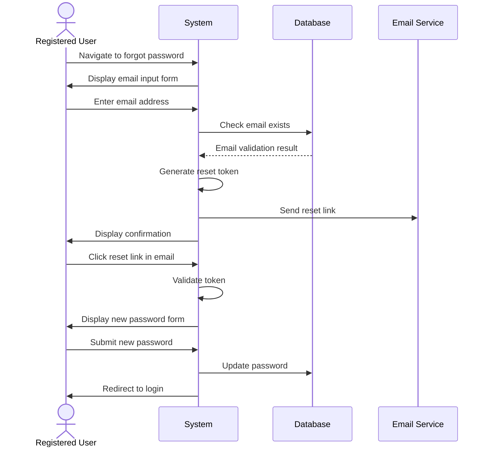

## UC-003: Password Recovery

**Actor**: Registered User  
**Preconditions**: User has forgotten their password  
**Page**: `/forgot-password`

### Diagram

### Main Flow
1. User navigates to "Forgot Password" page
2. System displays password recovery form
3. User enters registered email address
4. User submits the form
5. System validates email exists in the database
6. System generates password reset token
7. System sends password reset email with link
8. System displays confirmation message
9. User clicks link in email
10. System validates token
11. System displays password reset form
12. User enters new password and confirmation
13. User submits new password
14. System updates password
15. System displays success message
16. System redirects to login page

### Alternative Flows
**A1: Email Not Found**
- System displays generic "If email exists, reset link sent" message (security)
- Process ends

**A2: Expired Token**
- System displays "Reset link expired" message
- User must request new reset link

**A3: Invalid Token**
- System displays error message
- User is redirected to forgot password page

### Postconditions
- User password is updated
- Old password is invalidated
- User can login with new password

### Business Rules
- Password reset token expires after 1 hour
- Token can only be used once
- New password cannot be same as old password
- System sends reset email only to registered emails
