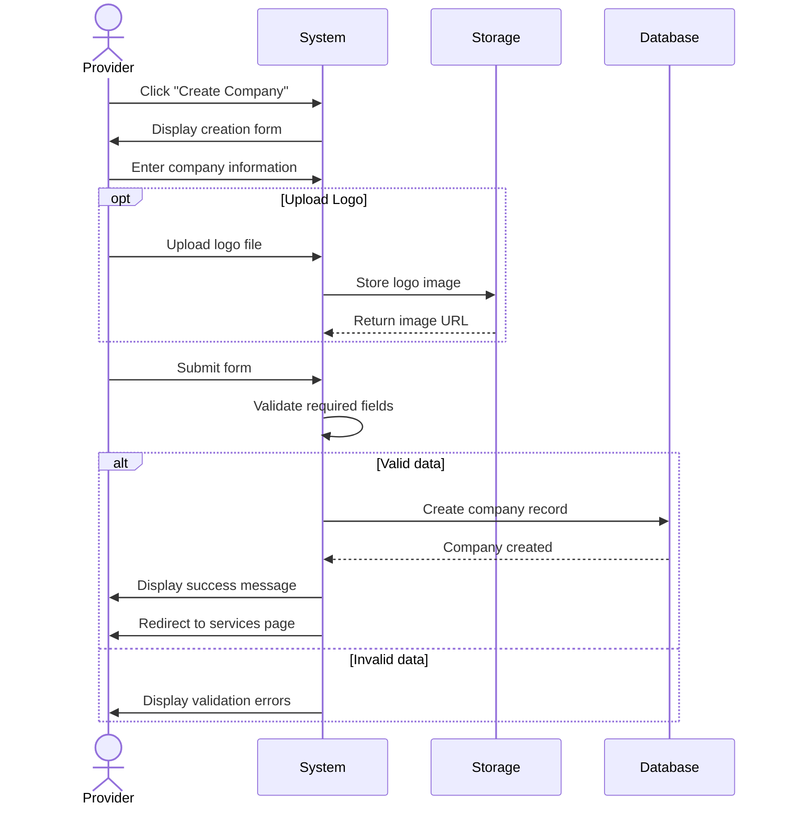

## UC-005: Create Company

**Actor**: Provider  
**Preconditions**: Provider is logged in  
**Page**: `/provider/companies/create`

### Diagram

### Main Flow
1. Provider clicks "Create Company" button
2. System displays company creation form
3. Provider enters company information:
   - Company name (required)
   - Company description
   - Business category
   - Logo upload
   - Contact information
     - Email
     - Phone number
     - Website
   - Address information
     - Street address
     - City
     - State/Province
     - Zip/Postal code
     - Country
   - Business hours
   - Social media links
4. Provider uploads company logo (if available)
5. Provider submits form
6. System validates all required fields
7. System creates company record
8. System displays success message
9. System redirects to company services page

### Alternative Flows
**A1: Missing Required Fields**
- System highlights missing fields
- System displays validation errors
- Provider completes required fields

**A2: Invalid Contact Information**
- System validates email format
- System validates phone number format
- Provider corrects invalid entries

**A3: Logo Upload Failure**
- System displays error message
- Provider can retry upload or continue without logo
- Logo can be added later

**A4: Cancel Creation**
- Provider clicks "Cancel" button
- System shows confirmation dialog
- System discards entered data
- Provider is redirected to companies list

**A5: Save as Draft**
- Provider saves incomplete company
- System stores draft
- Provider can complete later

### Postconditions
- New company is created
- Company is associated with provider
- Provider can add services to company

### Business Rules
- Company name must be unique for the provider
- Maximum logo file size: 5MB
- Accepted image formats: JPG, PNG, SVG
- Minimum required fields: name, category, email
- Provider can create unlimited companies

