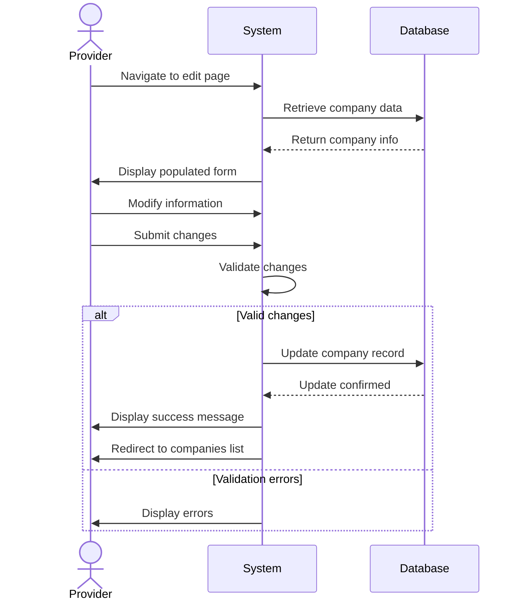

## UC-006: Edit Company

**Actor**: Provider  
**Preconditions**: Provider owns the company  
**Page**: `/provider/companies/:id/edit`

### Diagram

### Main Flow
1. Provider navigates to company edit page
2. System retrieves existing company data
3. System populates form with current information
4. Provider modifies company information
5. Provider submits updated form
6. System validates changes
7. System updates company record
8. System displays success message
9. System redirects to companies list or company details

### Alternative Flows
**A1: No Changes Made**
- Provider clicks save without changes
- System displays "No changes detected" message
- Provider is redirected back

**A2: Validation Errors**
- System highlights invalid fields
- Provider corrects errors
- Provider resubmits

**A3: Concurrent Edit Conflict**
- System detects company was modified by another session
- System displays conflict warning
- Provider can review changes and choose to overwrite or cancel

**A4: Cancel Edit**
- Provider clicks "Cancel"
- System shows confirmation if changes exist
- System discards changes
- Provider is redirected back

### Postconditions
- Company information is updated
- All associated services retain their connection
- Update timestamp is recorded

### Business Rules
- Only company owner can edit
- Company name must remain unique
- Active bookings are not affected by changes
- Logo changes reflect immediately on all pages

