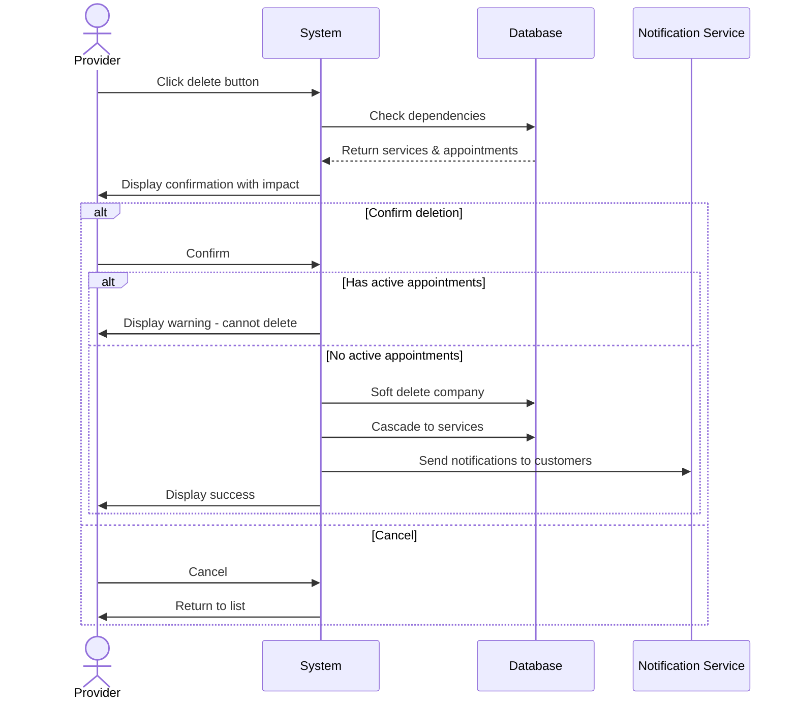

## UC-007: Delete Company

**Actor**: Provider  
**Preconditions**: Provider owns the company  
**Page**: `/provider/companies`

### Diagram

### Main Flow
1. Provider clicks delete button on company
2. System shows confirmation dialog with warning
3. System displays information about:
   - Number of services associated
   - Number of active appointments
   - Impact of deletion
4. Provider confirms deletion
5. System checks for dependencies
6. System soft-deletes or archives company
7. System displays success message
8. System refreshes companies list

### Alternative Flows
**A1: Company Has Active Appointments**
- System displays warning
- System prevents deletion
- System suggests completing or canceling appointments first

**A2: Company Has Services**
- System warns about service deletion
- Provider confirms deletion of all services
- System cascades soft-delete to services

**A3: Cancel Deletion**
- Provider cancels deletion
- System closes dialog
- No changes are made

**A4: Archive Instead of Delete**
- Provider chooses to archive
- System marks company as inactive
- Company data is preserved but hidden

### Postconditions
- Company is deleted or archived
- Associated services are handled according to cascade rules
- Future appointments are canceled with notifications

### Business Rules
- Cannot delete company with active appointments
- Deleted companies can be restored within 30 days
- After 30 days, deletion becomes permanent
- All customers with bookings are notified
- Historical appointment data is preserved for records

*Last updated: March 6, 2026*
