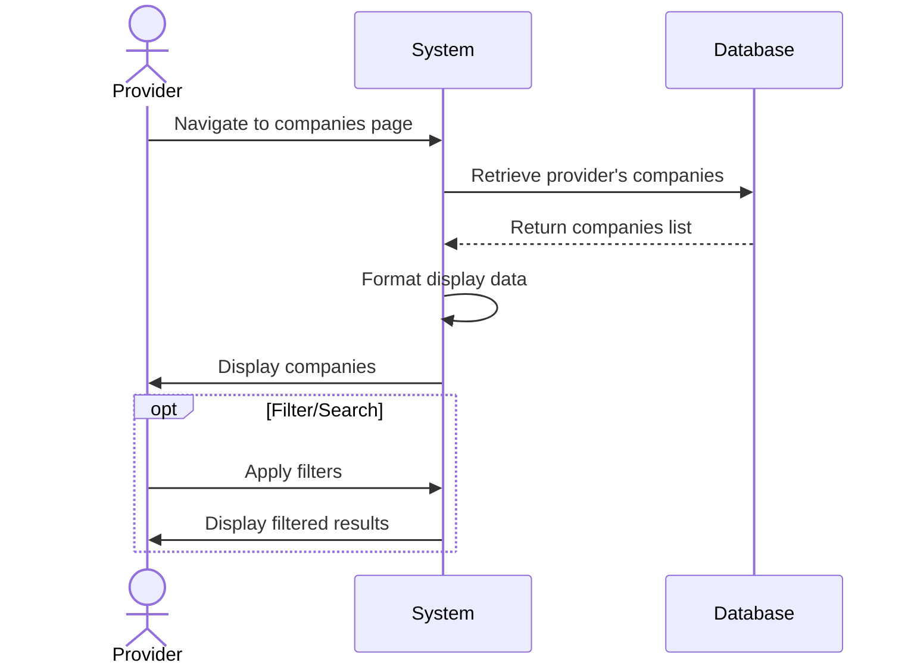

## UC-008: View Companies

**Actor**: Provider  
**Preconditions**: Provider is logged in and has completed onboarding  
**Page**: `/provider/companies`

### Diagram

### Main Flow
1. Provider navigates to Companies page
2. System retrieves all companies belonging to the provider
3. System displays companies in a list/grid view with:
   - Company name
   - Company logo
   - Number of services
   - Status (Active/Inactive)
   - Quick action buttons
4. Provider can search/filter companies
5. Provider can sort companies by various criteria

### Alternative Flows
**A1: No Companies Exist**
- System displays empty state
- System shows "Create Company" call-to-action button
- Provider can create first company

**A2: Filter Results**
- Provider applies filters (status, date created, etc.)
- System updates display with filtered results

**A3: Search Companies**
- Provider enters search term
- System displays matching companies

### Postconditions
- Provider views their companies
- Provider can navigate to company details or edit

### Business Rules
- Only owned companies are displayed
- Inactive companies are shown with visual indicator
- List is paginated if more than 20 companies

