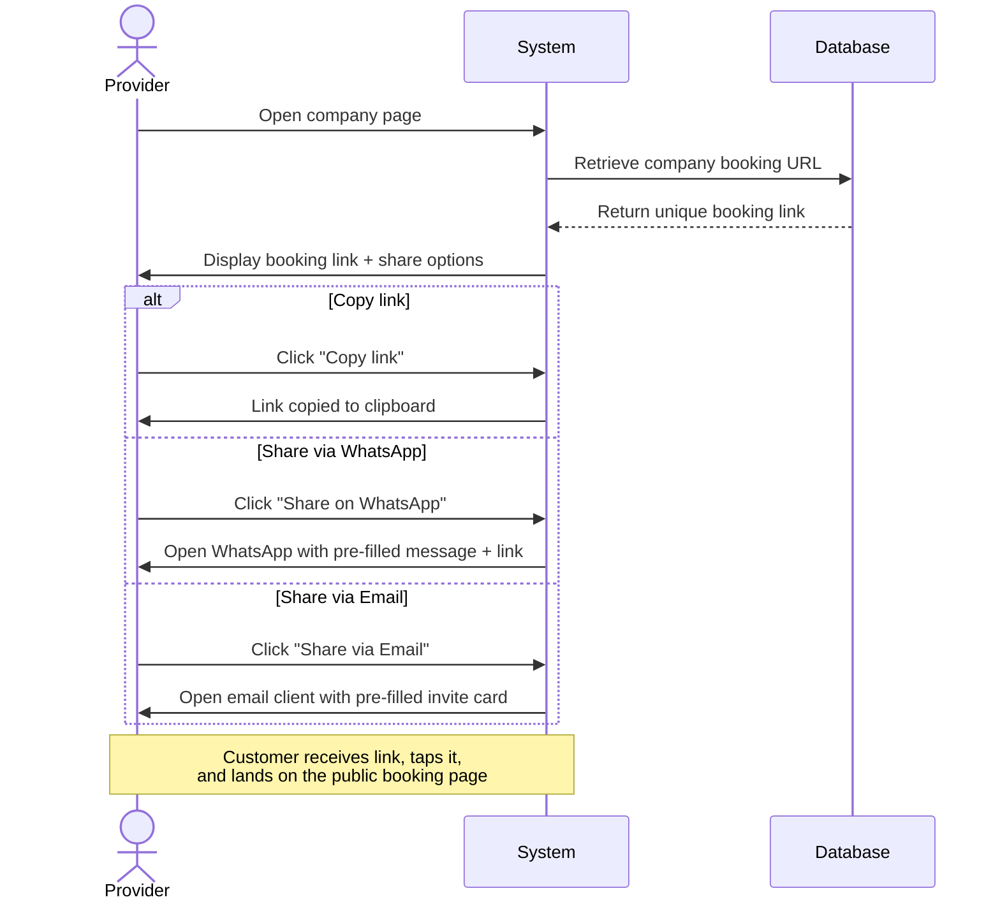

## UC-009: Share Booking Link

**ID**: UC-032  
**Name**: Share Booking Link  
**Actor**: Provider  
**Preconditions**: Provider has at least one company with at least one service configured  
**Page**: `/provider/companies/:id`

### Diagram

### Main Flow

1. Provider opens their company page after completing setup
2. System displays the company's unique booking link
3. System shows share options:
   - **Copy link** — copies the URL to clipboard
   - **Share on WhatsApp** — opens WhatsApp with a pre-formatted message containing the link
   - **Share via Email** — opens email client with a pre-designed invite card
4. Provider shares the link with their customers
5. Customer taps/clicks the link and lands on the public booking page for that company
6. Customer can browse services and book an appointment directly

### Alternative Flows

**A1: Incomplete Setup**
- If company has no services or no working hours configured, system shows a warning
- Provider is prompted to complete setup before sharing

**A2: Regenerate Link**
- Provider can regenerate their booking link (e.g., to invalidate old shared links)
- System warns that old links will stop working
- Provider confirms → new unique link is generated

### Postconditions
- Provider has a shareable booking URL
- Customers who receive the link can book appointments without needing to register first (guest booking) or by logging in

### Business Rules
- Each company has one unique booking link
- The link encodes the company identifier, not the provider's personal account
- Links must remain stable unless explicitly regenerated by the provider
- The share card (WhatsApp/Email) includes the company name, a short description, and the link

### Notes (MVP Scope)
- For MVP: implement **Copy link** and **Share on WhatsApp** only
- Email invite card and link regeneration are post-MVP
- The customer-facing booking page (destination of the link) is documented separately as part of the customer-side use cases
