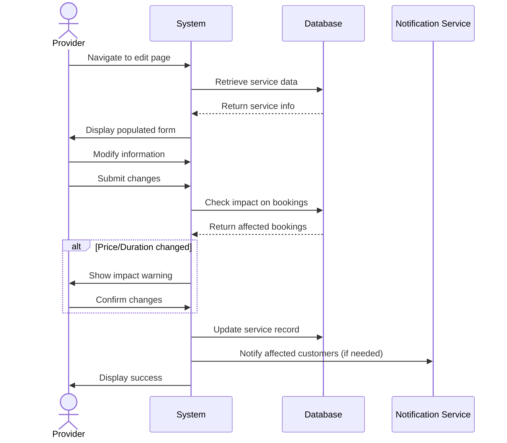

## UC-011: Edit Service

**Actor**: Provider  
**Preconditions**: Provider owns the company and service  
**Page**: `/provider/companies/:id/services/edit` or inline edit

### Diagram

### Main Flow
1. Provider navigates to service edit page or clicks edit button
2. System retrieves existing service data
3. System populates form with current information
4. Provider modifies service information
5. Provider submits updated form
6. System validates changes
7. System checks impact on existing bookings
8. System updates service record
9. System displays success message
10. System updates all affected future bookings (if necessary)
11. System redirects to services list

### Alternative Flows
**A1: Price Changed with Existing Bookings**
- System shows warning about future bookings
- System offers options:
  - Apply to new bookings only
  - Apply to all future bookings
  - Honor old price for existing bookings
- Provider selects option
- System applies changes accordingly

**A2: Duration Changed**
- System checks for scheduling conflicts
- System displays affected appointments
- Provider confirms changes
- System adjusts appointment slots

**A3: No Changes Made**
- Provider clicks save without changes
- System displays "No changes detected"
- Provider is redirected back

**A4: Validation Errors**
- System highlights invalid fields
- Provider corrects errors
- Provider resubmits

**A5: Cancel Edit**
- Provider clicks "Cancel"
- System shows confirmation if changes exist
- System discards changes
- Provider is redirected back

### Postconditions
- Service information is updated
- Future bookings reflect changes
- Service update history is logged

### Business Rules
- Price changes don't affect past appointments
- Duration changes may require appointment adjustments
- Customers are notified of significant changes
- Old pricing honored for confirmed bookings unless specified

