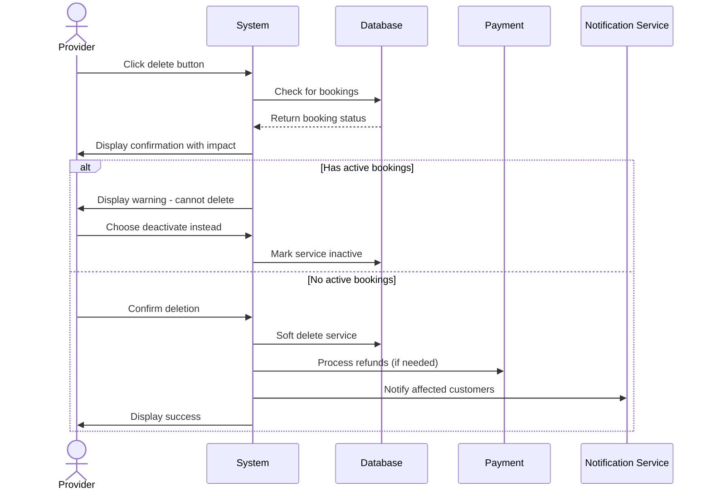

## UC-012: Delete Service

**Actor**: Provider  
**Preconditions**: Provider owns the company and service  
**Page**: `/provider/companies/:id/services`

### Diagram

### Main Flow
1. Provider clicks delete button on service
2. System displays confirmation dialog with warning
3. System shows impact information:
   - Number of active bookings
   - Future scheduled appointments
   - Total revenue at risk
4. Provider confirms deletion
5. System checks for active bookings
6. System soft-deletes or deactivates service
7. System handles existing bookings per policy
8. System displays success message
9. System refreshes services list

### Alternative Flows
**A1: Service Has Active Bookings**
- System prevents immediate deletion
- System offers options:
  - Complete active bookings then delete
  - Cancel all bookings and delete
  - Deactivate instead of delete
- Provider chooses option
- System processes accordingly

**A2: Service Has Future Bookings**
- System displays list of future bookings
- System sends cancellation notices to customers
- System processes refunds (if applicable)
- System completes deletion

**A3: Cancel Deletion**
- Provider cancels deletion
- System closes dialog
- No changes are made

**A4: Deactivate Instead**
- Provider chooses to deactivate
- System marks service as inactive
- Service stops accepting new bookings
- Existing bookings continue

### Postconditions
- Service is deleted or deactivated
- Customers with future bookings are notified
- Service no longer appears in public listings
- Historical data is preserved

### Business Rules
- Cannot delete service with active (ongoing) appointments
- Services with future bookings require confirmation
- Deleted services can be restored within 30 days
- After 30 days, deletion becomes permanent
- All affected customers receive notifications
- Refund policy is applied automatically
- Historical booking data is preserved for reporting

*Last updated: March 6, 2026*
