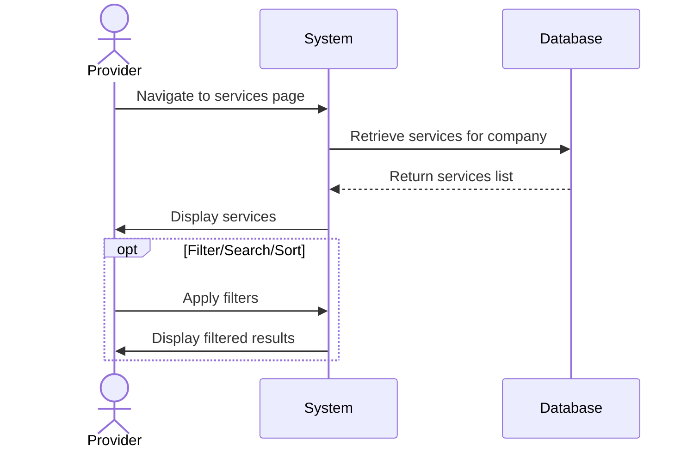

## UC-013: View Services

**Actor**: Provider  
**Preconditions**: Provider is logged in and has at least one company  
**Page**: `/provider/companies/:id/services`

### Diagram

### Main Flow
1. Provider navigates to services page for a specific company
2. System retrieves all services for the selected company
3. System displays services in list/grid format with:
   - Service name
   - Service description (truncated)
   - Duration
   - Price
   - Status (Active/Inactive)
   - Number of bookings
   - Quick action buttons (Edit, Deactivate, Delete)
4. Provider can view service details
5. Provider can perform quick actions on services

### Alternative Flows
**A1: No Services Exist**
- System displays empty state message
- System shows "Create First Service" call-to-action
- Provider can create initial service

**A2: Filter Services**
- Provider applies filters (status, price range, duration)
- System displays filtered results

**A3: Search Services**
- Provider enters search term
- System searches by service name and description
- System displays matching services

**A4: Sort Services**
- Provider selects sort criteria (name, price, date created)
- System reorders services accordingly

### Postconditions
- Provider views all company services
- Provider can manage services

### Business Rules
- Only services for the selected company are shown
- Inactive services are visually distinguished
- List is paginated if more than 20 services

