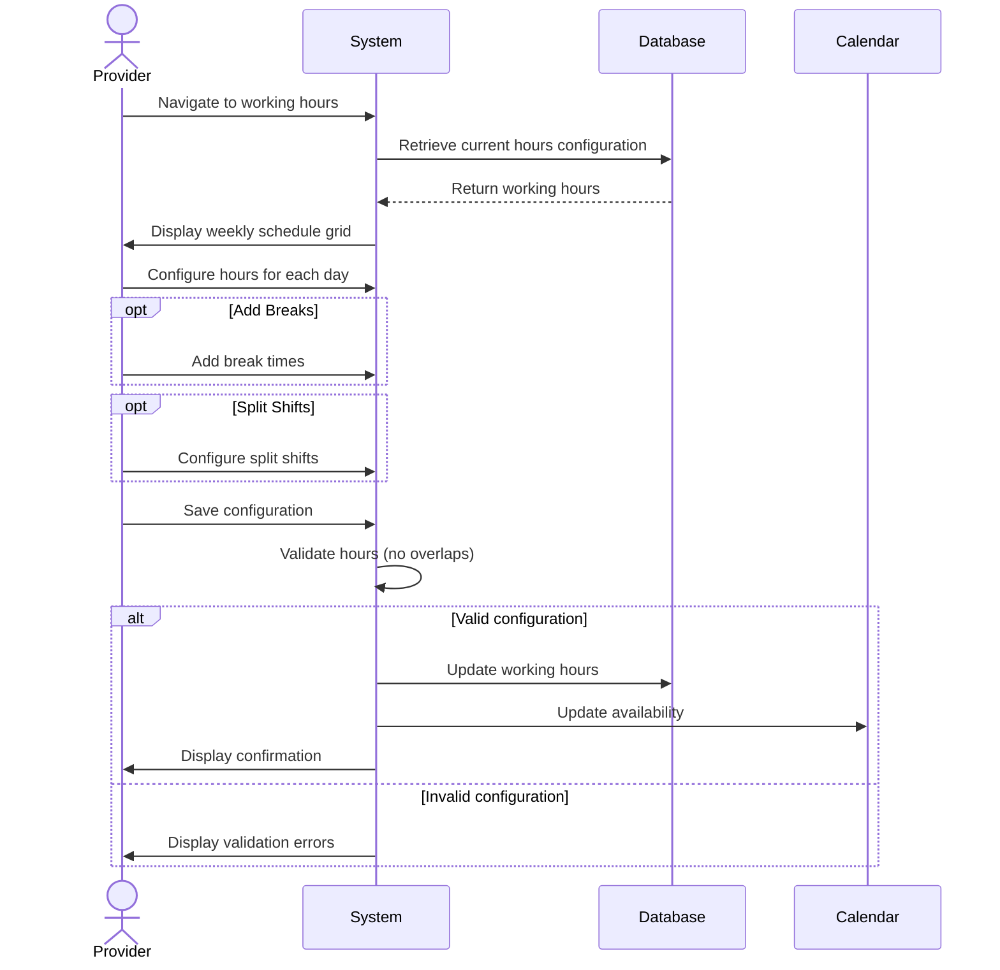

## UC-014: Configure Working Hours

**Actor**: Provider  
**Preconditions**: Provider is logged in  
**Page**: `/provider/hours`

### Diagram

### Main Flow
1. Provider navigates to working hours configuration
2. System displays current working hours setup
3. System shows weekly schedule grid with:
   - Days of week (Monday-Sunday)
   - Time slots for each day
   - On/Off toggle for each day
   - Multiple time ranges per day option
4. Provider configures hours:
   - Toggles days on/off
   - Sets start time for each day
   - Sets end time for each day
   - Adds break times (optional)
   - Adds split shifts (optional)
5. Provider can apply templates:
   - Mon-Fri standard hours
   - Custom patterns
   - Copy from another company
6. Provider saves configuration
7. System validates hours (no overlaps, logical times)
8. System updates availability
9. System adjusts appointment acceptance rules
10. System displays confirmation

### Alternative Flows
**A1: Add Break Time**
- Provider clicks "Add Break"
- Provider specifies break start and end time
- System marks break time as unavailable
- Appointments don't overlap breaks

**A2: Configure Split Shift**
- Provider enables split shift for a day
- Provider sets morning hours (e.g., 9am-1pm)
- Provider sets evening hours (e.g., 5pm-9pm)
- System treats as separate availability blocks

**A3: Set Different Hours per Company/Service**
- Provider clicks "Advanced Settings"
- Provider configures hours by company
- Provider configures hours by service type
- System applies specific rules accordingly

**A4: Temporary Hours Change**
- Provider sets date range for temporary hours
- Provider configures special hours
- System applies temporary schedule
- System reverts to regular hours after period

**A5: Validation Error**
- System detects invalid configuration
- System highlights issues (e.g., end before start)
- Provider corrects errors
- Provider resubmits

**A6: Copy to All Days**
- Provider configures one day
- Provider clicks "Copy to All Days"
- System applies same hours to all days
- Provider can adjust individual days after

### Postconditions
- Working hours are updated
- Booking system reflects new availability
- Existing appointments outside new hours are flagged
- Future bookings respect new hours

### Business Rules
- Minimum work period: 30 minutes
- Maximum work period: 16 hours per day
- Break times minimum: 15 minutes
- Hours can't overlap within same day
- Changes apply to future bookings only
- Existing appointments are honored
- 24-hour advance notice recommended for hour changes

