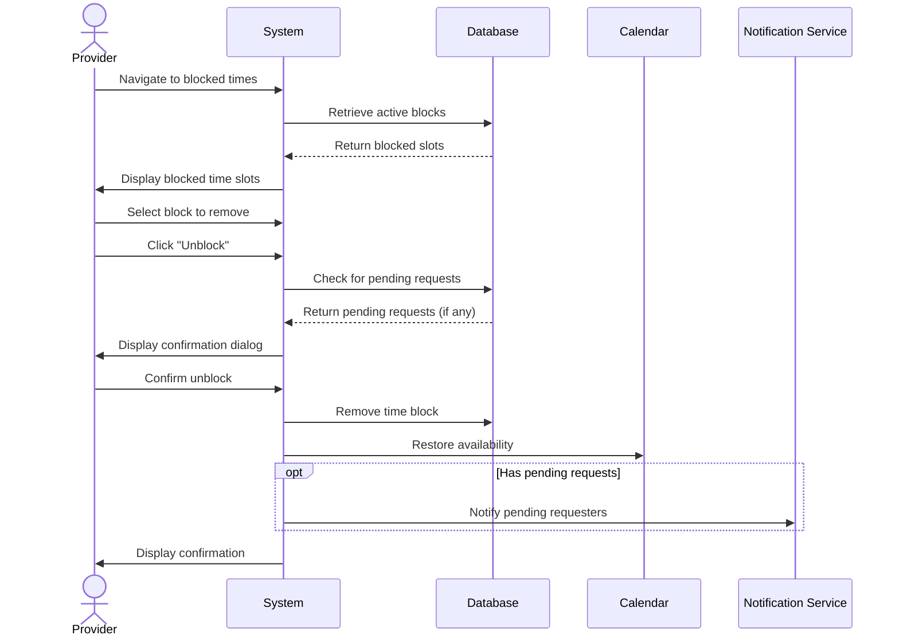

## UC-016: Unblock Time Slots

**Actor**: Provider  
**Preconditions**: Provider has blocked time slots  
**Page**: `/provider/block-time` or `/provider/calendar`

### Diagram

### Main Flow
1. Provider navigates to blocked times list or calendar
2. System displays all active blocked time slots
3. Provider identifies time slot to unblock
4. Provider clicks "Unblock" or "Remove Block" button
5. System displays confirmation dialog showing:
   - Time range being unblocked
   - Potential bookings that could be made
   - Any pending requests for that time
6. Provider confirms unblock action
7. System removes time block
8. System restores availability for those time slots
9. System notifies pending requesters (if any)
10. System displays confirmation

### Alternative Flows
**A1: Unblock Recurring Block Series**
- Provider selects recurring block
- System offers options:
  - Unblock this instance only
  - Unblock this and all future instances
  - Unblock entire series
- Provider chooses option
- System processes accordingly

**A2: Partial Unblock**
- Provider wants to unblock part of blocked period
- Provider edits block times
- Provider shortens blocked period
- System unblocks only requested portion

**A3: Pending Requests Exist**
- System shows pending booking requests for that time
- Provider can review requests
- Provider can accept requests immediately
- System processes acceptances

**A4: Cancel Unblock**
- Provider clicks "Cancel" in confirmation
- System closes dialog
- Block remains active
- No changes are made

**A5: Bulk Unblock**
- Provider selects multiple blocked slots
- Provider clicks "Unblock Selected"
- System confirms bulk action
- System removes all selected blocks

### Postconditions
- Time slots are available again
- Booking system accepts new requests for those times
- Calendar reflects availability
- Pending requesters are notified

### Business Rules
- Past blocked times cannot be unblocked (irrelevant)
- Unblocking doesn't automatically create appointments
- Customers searching for availability see newly opened slots
- Pending requests get priority for newly opened slots
- Unblock action is logged in history
- Recurring blocks can be managed individually or as series

*Last updated: March 6, 2026*
