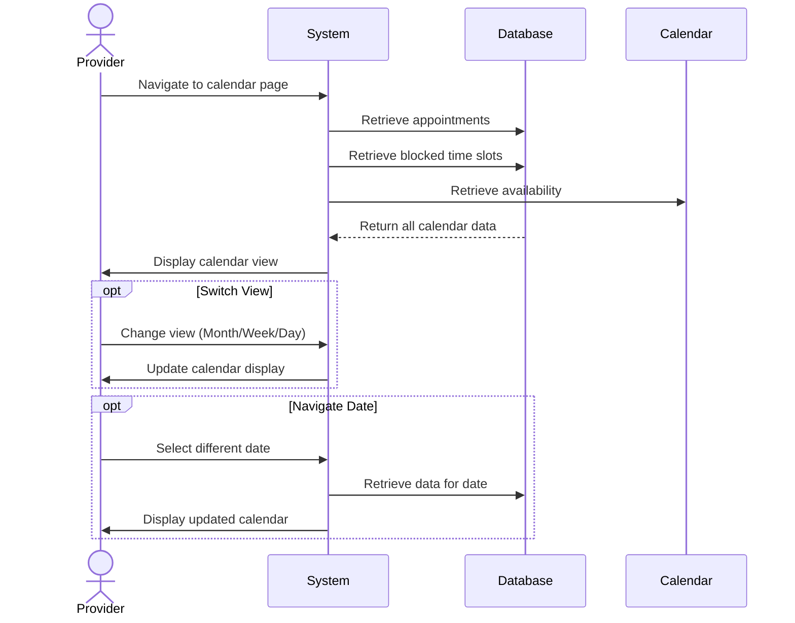

## UC-017: View Calendar

**Actor**: Provider  
**Preconditions**: Provider is logged in  
**Page**: `/provider/calendar`

### Diagram

### Main Flow
1. Provider navigates to calendar page
2. System retrieves provider's appointments and availability
3. System displays calendar with:
   - Monthly/Weekly/Daily view options
   - Confirmed appointments
   - Blocked time slots
   - Available time slots
   - Pending appointment requests
   - Color-coded indicators by status/company
4. Provider can interact with calendar:
   - Switch between views
   - Navigate to different dates
   - Click appointments for details
   - Click time slots to block/unblock
5. Provider can see appointment details on hover/click

### Alternative Flows
**A1: Switch Calendar View**
- Provider clicks view toggle (Month/Week/Day)
- System updates calendar display
- Appointments are reorganized accordingly

**A2: Navigate to Specific Date**
- Provider uses date picker
- System jumps to selected date
- Appointments for that period are displayed

**A3: Filter by Company/Service**
- Provider applies filter
- System shows only relevant appointments
- Calendar is updated with filtered data

**A4: Export Calendar**
- Provider clicks "Export" button
- System offers export formats (iCal, CSV, PDF)
- Provider selects format
- System generates and downloads file

**A5: Sync with External Calendar**
- Provider clicks "Sync Calendar"
- System offers integration options (Google, Outlook, Apple)
- Provider authorizes connection
- System establishes sync

### Postconditions
- Provider views their schedule
- Provider can manage time efficiently
- Conflicts are visually identified

### Business Rules
- Calendar displays times in provider's timezone
- Past dates are read-only
- Maximum forward view: 6 months
- Auto-refresh every 5 minutes
- Double-bookings are prevented
- Buffer times are visually indicated

