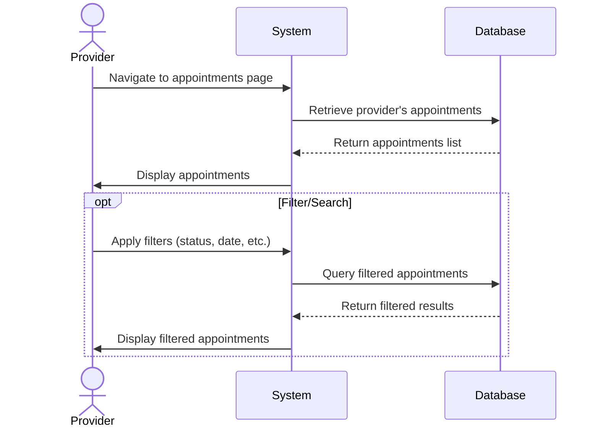

## UC-018: View Appointments

**Actor**: Provider  
**Preconditions**: Provider is logged in  
**Page**: `/provider/appointments`

### Diagram

### Main Flow
1. Provider navigates to appointments page
2. System retrieves all appointments for the provider
3. System displays appointments in list view with:
   - Customer name
   - Service name
   - Company name
   - Date and time
   - Duration
   - Status (Pending, Confirmed, Completed, Cancelled)
   - Price
   - Quick action buttons
4. Provider can view different appointment views:
   - All appointments
   - Today's appointments
   - Upcoming appointments
   - Past appointments
   - Pending requests
5. Provider can filter and sort appointments

### Alternative Flows
**A1: No Appointments**
- System displays empty state
- System shows helpful message
- System suggests promoting services

**A2: Filter by Status**
- Provider selects status filter
- System displays only matching appointments

**A3: Filter by Date Range**
- Provider selects date range
- System displays appointments within range

**A4: Filter by Company/Service**
- Provider selects company or service filter
- System displays relevant appointments

**A5: Search Appointments**
- Provider enters search term (customer name, booking ID)
- System displays matching results

### Postconditions
- Provider views their appointments
- Provider can take actions on appointments

### Business Rules
- Appointments are sorted by date/time by default
- Past appointments older than 1 year are archived
- Cancelled appointments are marked but retained
- List is paginated for performance

