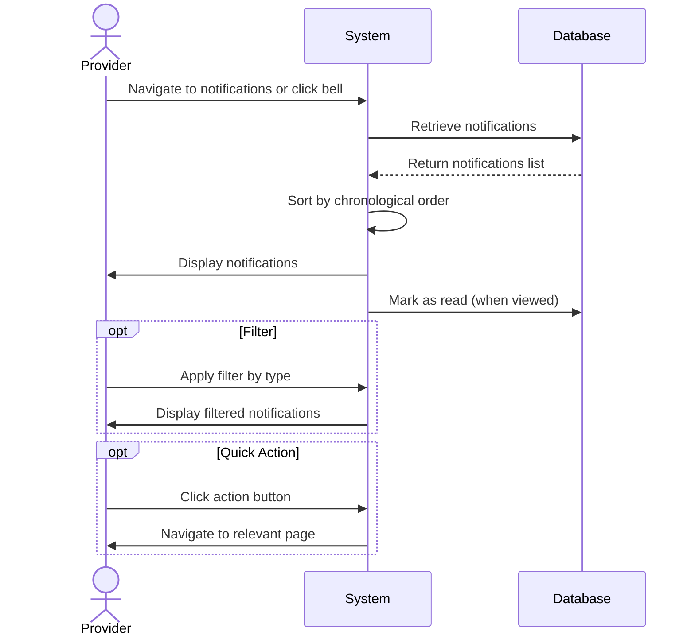

## UC-023: View Notifications

**Actor**: Provider  
**Preconditions**: Provider is logged in  
**Page**: `/provider/notifications`

### Diagram

### Main Flow
1. Provider navigates to notifications page or clicks notification bell
2. System retrieves all notifications for the provider
3. System displays notifications in chronological order:
   - **New Booking Requests**
     - Customer name
     - Service requested
     - Requested date/time
     - Quick action buttons (Accept/Reject)
   - **Booking Confirmations**
     - Confirmed appointment details
     - Customer information
   - **Cancellations**
     - Cancelled appointment info
     - Cancellation reason
     - Refund status
   - **Payment Notifications**
     - Payment received
     - Payout processed
     - Failed payments
   - **Profile Updates**
     - Review received
     - Profile verification status
     - Settings changes
   - **System Notifications**
     - Account updates
     - Policy changes
     - Feature announcements
4. System marks notifications as read when viewed
5. Provider can filter notifications by type
6. Provider can mark all as read
7. Provider can delete notifications

### Alternative Flows
**A1: No Notifications**
- System displays empty state
- System shows helpful message
- System indicates when to expect notifications

**A2: Filter by Type**
- Provider selects notification category
- System displays only selected type
- Unread count updates accordingly

**A3: Filter by Read/Unread**
- Provider toggles read/unread filter
- System displays filtered notifications
- Provider can mark individual items as read/unread

**A4: Quick Actions from Notification**
- Provider clicks action button (e.g., "View Appointment")
- System navigates to relevant page
- Notification is marked as read
- Context is preserved

**A5: Delete Notification**
- Provider clicks delete on notification
- System removes notification from list
- Action cannot be undone
- System notification remains in history

**A6: Search Notifications**
- Provider enters search term
- System searches notification content
- System displays matching results

### Postconditions
- Provider is informed of important events
- Unread count is updated
- Provider can take action on notifiable events

### Business Rules
- Notifications expire after 90 days
- Critical notifications cannot be deleted
- Unread count shows in navigation badge
- Maximum 1000 notifications stored per user
- Older notifications are auto-archived
- Real-time notifications arrive within 30 seconds

