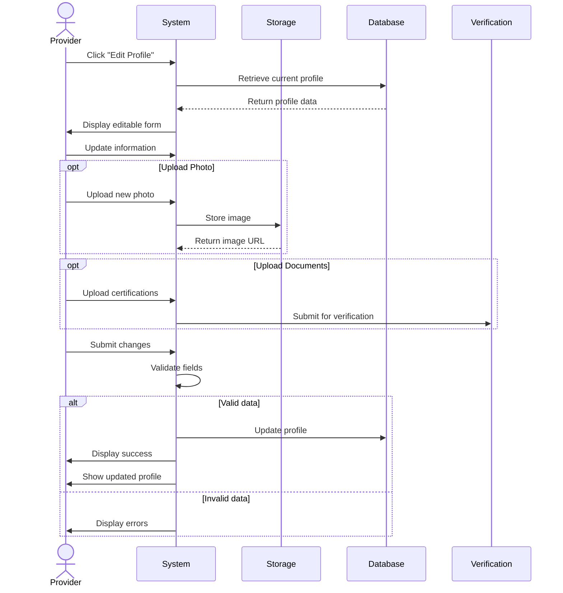

## UC-024: Edit Provider Profile

**Actor**: Provider  
**Preconditions**: Provider is logged in  
**Page**: `/provider/profile` (edit mode)

### Diagram

### Main Flow
1. Provider clicks "Edit Profile" button
2. System displays editable profile form
3. Provider updates information:
   - **Personal Details**
     - Name
     - Profile photo upload/change
     - Contact information
     - Bio (with character limit)
   - **Professional Details**
     - Business description
     - Experience
     - Certifications (upload documents)
     - Specializations (tags/categories)
     - Education/Training
   - **Services & Specialties**
     - Primary specializations
     - Service keywords
     - Target audience
   - **Media & Portfolio**
     - Upload photos
     - Add portfolio items
     - Video introduction (optional)
   - **Location & Availability**
     - Service areas/regions
     - Languages
     - Accessibility options
4. Provider uploads new images/documents (if any)
5. Provider submits changes
6. System validates all fields
7. System checks for required information
8. System updates profile
9. System displays success message
10. System shows updated profile

### Alternative Flows
**A1: Photo Upload**
- Provider clicks "Change Photo"
- Provider selects image file
- System validates file type and size
- Provider crops/adjusts image
- System uploads and processes image
- Profile photo is updated

**A2: Incomplete Required Fields**
- System highlights missing required fields
- System shows validation errors
- Provider completes required information
- Provider resubmits

**A3: Document Verification Upload**
- Provider uploads certification documents
- System sends for verification
- Provider receives verification status
- Verified badges appear on profile

**A4: Cancel Changes**
- Provider clicks "Cancel"
- System shows confirmation if changes exist
- System discards unsaved changes
- Provider returns to view mode

**A5: Save as Draft**
- Provider saves partial changes
- System stores draft
- Provider can continue editing later
- Changes not visible to public yet

**A6: Invalid File Upload**
- System validates file format
- System checks file size
- System displays error if invalid
- Provider uploads valid file

### Postconditions
- Provider profile is updated
- Changes reflect in public profile
- Profile completion percentage updates
- Search/discovery uses updated information

### Business Rules
- Profile photo: max 5MB, JPG/PNG only
- Bio: max 500 characters
- Maximum 20 portfolio images
- Certification documents require manual verification
- Changes to verified information may require re-verification
- Some fields may take 24 hours to update in search
- Inappropriate content is flagged automatically

