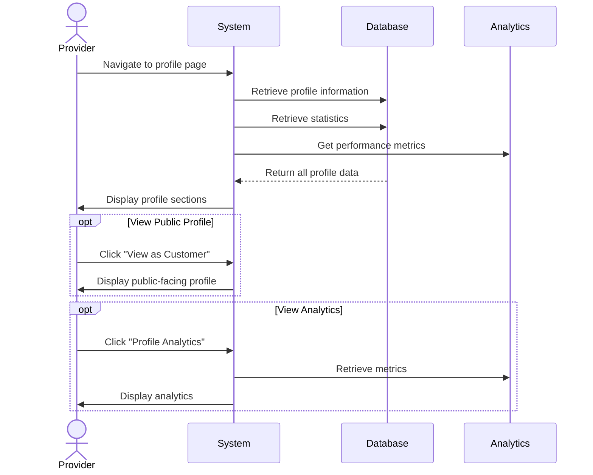

## UC-025: View Provider Profile

**Actor**: Provider  
**Preconditions**: Provider is logged in  
**Page**: `/provider/profile`

### Diagram

### Main Flow
1. Provider navigates to profile page
2. System retrieves provider's profile information
3. System displays profile with sections:
   - **Personal Information**
     - Full name
     - Profile photo
     - Email address
     - Phone number
     - Bio/About section
   - **Professional Information**
     - Business description
     - Years of experience
     - Certifications
     - Specializations
   - **Business Details**
     - Service areas
     - Languages spoken
     - Accepted payment methods
   - **Public Profile Preview**
     - How customers see the profile
     - Rating and reviews summary
     - Portfolio/Gallery
   - **Statistics**
     - Total bookings
     - Completion rate
     - Average rating
     - Customer satisfaction
4. Provider can navigate to edit mode

### Alternative Flows
**A1: View Public Profile**
- Provider clicks "View as Customer"
- System displays public-facing profile
- Provider sees exactly what customers see
- Provider can return to full profile view

**A2: View Profile Analytics**
- Provider clicks "Profile Analytics"
- System shows profile performance metrics
  - Profile views
  - Conversion rate
  - Popular services
  - Peak booking times
- Charts and graphs display trends

**A3: Share Profile**
- Provider clicks "Share Profile"
- System generates shareable link
- Provider can share via social media, email
- System provides QR code for offline sharing

### Postconditions
- Provider reviews their profile information
- Provider can identify areas needing updates

### Business Rules
- Profile completion percentage is calculated
- Incomplete profiles show completion prompts
- Public profile respects privacy settings
- Statistics update daily
- Profile photos must meet size/format requirements

