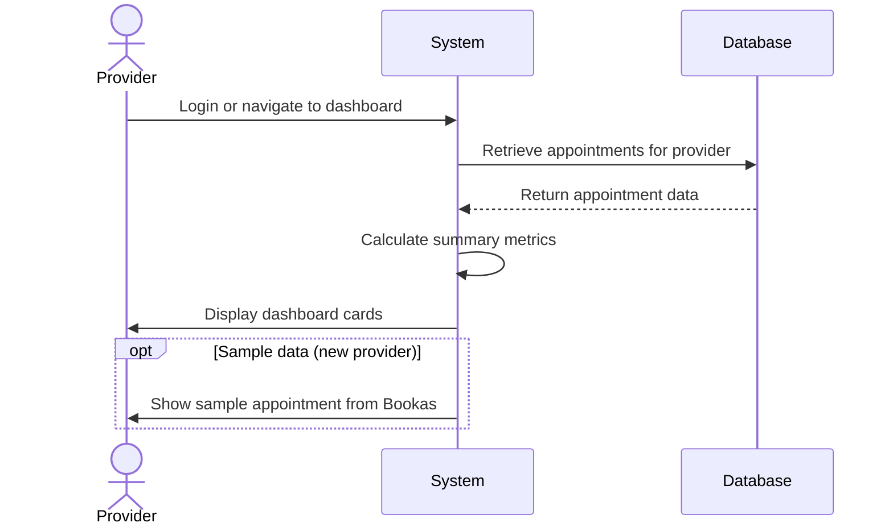

## UC-026: View Analytics Dashboard

**Actor**: Provider  
**Preconditions**: Provider is logged in  
**Page**: `/provider` (Dashboard)

### Diagram

### Main Flow
1. Provider logs in or navigates to dashboard
2. System retrieves appointment data for the current provider
3. System displays 5 summary cards:
   - **Appointments Today** — count of confirmed appointments for today
   - **This Week** — count of confirmed appointments for the current week
   - **This Month** — count of confirmed appointments for the current month
   - **Pending Requests** — count of appointments awaiting accept/decline (actionable)
   - **Cancelled This Month** — count of cancelled appointments (health signal)
4. System displays the next upcoming appointment prominently below the cards
5. If the provider has no appointments yet, the system shows the guided sample appointment from Bookas

### Alternative Flows
**A1: No data yet (new provider)**
- System shows all cards at zero
- System displays the sample Bookas appointment as a tutorial prompt
- Cards fill with real data as the provider receives bookings

**A2: Pending requests > 0**
- Pending Requests card is highlighted
- Quick action button "Review" navigates to the appointments list filtered to pending

### Postconditions
- Provider has an at-a-glance health check of their business
- Pending requests are surfaced immediately for action

### Business Rules
- All counts are scoped to the logged-in provider across all their companies
- "Today", "This Week", "This Month" are calculated in the provider's configured timezone

---

### Post-MVP (out of scope for now)
- Charts and trend graphs (require sufficient historical data)
- Revenue tracking and revenue cards
- Customer retention / repeat rate metrics
- Dashboard customization (widget drag & drop)
- Filter by company or service
- Goal setting and progress indicators
- UC-029: Export appointment history (CSV/PDF)
- Important metrics are immediately visible
- Provider can access detailed information as needed

### Business Rules
- Dashboard updates every 5 minutes
- Data accuracy: 99.9%
- Metrics calculated on trailing periods
- Currency displays in provider's configured currency
- Timezone matches provider's settings
- Historical comparisons show percent change
- Widgets can be hidden but not removed completely

*Last updated: March 6, 2026*
