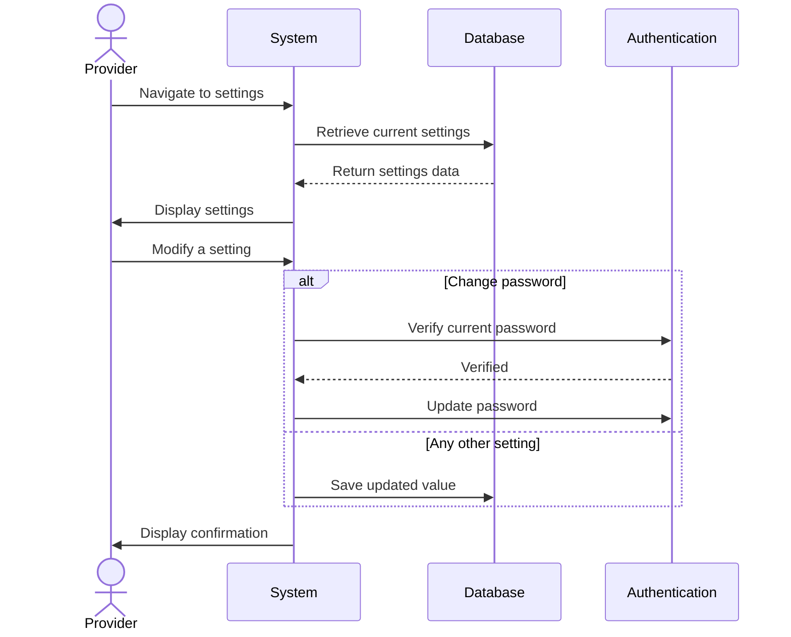

## UC-027: Manage Settings

**Actor**: Provider  
**Preconditions**: Provider is logged in  
**Page**: `/provider/settings`

### Diagram

### Main Flow
1. Provider navigates to settings page
2. System loads and displays current settings in two sections:
   - **Account**
     - Change email
     - Change password
     - Timezone
     - Language
   - **Notifications** *(UC-028)*
     - New booking request — push / email on/off
     - Booking confirmed — push / email on/off
     - Cancellation — push / email on/off
     - Reschedule request — push / email on/off
   - **Booking Behaviour**
     - Auto-accept bookings (toggle)
     - Advance booking window (how many days ahead customers can book)
     - Buffer time between appointments (minutes)
     - Cancellation policy (Flexible 24h / Moderate 48h / Strict 72h)
3. Provider modifies a setting
4. Provider saves
5. System validates and applies the change
6. System shows confirmation

### Alternative Flows
**A1: Change Password**
- System requires current password before accepting a new one
- System validates password strength
- System sends confirmation email on success

**A2: Toggle Auto-Accept**
- When enabled, incoming booking requests are confirmed automatically without provider review
- System warns the provider that this skips the Accept/Decline step

**A3: Set Cancellation Policy**
- Provider picks from three presets:
  - **Flexible** — customer can cancel up to 24h before
  - **Moderate** — 48h notice required
  - **Strict** — 72h notice required
- The selected policy is shown to customers at booking time

### Postconditions
- Settings are saved and immediately applied to new bookings
- Timezone change recalculates all displayed appointment times

### Business Rules
- Timezone must be set before the provider goes live — affects all appointment scheduling
- Cancellation policy is per-provider, not per-service (MVP)
- Notification preferences default to all-on at registration

---

### Post-MVP (out of scope for now)
- Two-factor authentication (2FA)
- Google / Outlook / Apple Calendar sync
- Payment methods and payout schedule
- Privacy and profile visibility controls
- Session management and login history
- Data export and account deletion
- User experience adapts to preferences

### Business Rules
- Password changes require current password verification
- 2FA is recommended but optional
- Some settings require email verification
- Cancellation policy applies to new bookings only
- Calendar sync is bidirectional
- Account deletion has 30-day grace period
- Critical setting changes send email notifications
- Payment settings may require identity verification

*Last updated: March 6, 2026*
