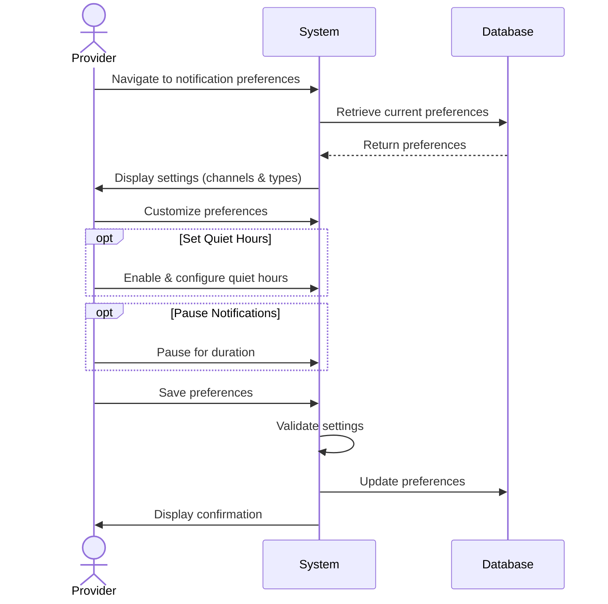

## UC-028: Manage Notification Preferences

**Actor**: Provider  
**Preconditions**: Provider is logged in  
**Page**: `/provider/settings` (Notifications section)

### Diagram

### Main Flow
1. Provider navigates to notification preferences
2. System displays notification settings organized by:
   - **Notification Channels**
     - In-app notifications (on/off)
     - Email notifications (on/off)
     - SMS notifications (on/off)
     - Push notifications (on/off)
   - **Notification Types**
     - New booking requests
     - Booking confirmations
     - Cancellations
     - Reschedule requests
     - Payments
     - Reviews
     - Messages from customers
     - System updates
     - Marketing communications
   - **Frequency Settings**
     - Instant (real-time)
     - Digest (daily summary)
     - Digest (weekly summary)
     - Critical only
3. Provider customizes preferences per type and channel
4. Provider sets quiet hours (optional)
5. Provider saves preferences
6. System validates settings
7. System applies notification rules
8. System displays confirmation

### Alternative Flows
**A1: Configure Quiet Hours**
- Provider enables "Quiet Hours"
- Provider sets start time (e.g., 10 PM)
- Provider sets end time (e.g., 7 AM)
- Provider selects days to apply
- System suppresses non-critical notifications during hours

**A2: Custom Notification Sounds**
- Provider clicks "Customize Sounds"
- System shows sound options
- Provider tests sounds
- Provider selects preferred sounds per type
- System saves sound preferences

**A3: Channel-Specific Settings**
- Provider configures email preferences:
  - HTML vs plain text
  - Email frequency
  - Batch similar notifications
- Provider configures SMS preferences:
  - Phone number
  - Critical only option

**A4: Temporary Pause**
- Provider clicks "Pause Notifications"
- Provider selects pause duration (1 hour to 1 week)
- System pauses non-critical notifications
- System resumes after duration

**A5: Use Template**
- Provider selects preset template:
  - "Always On" (all notifications)
  - "Business Hours Only"
  - "Critical Only"
  - "Custom"
- System applies template settings
- Provider can further customize

### Postconditions
- Notification preferences are saved
- Provider receives notifications per preferences
- System respects quiet hours and channel choices
- Spam is minimized

### Business Rules
- Critical notifications (booking within 2 hours) always notify
- Minimum one notification channel must be active
- SMS notifications may incur charges
- Quiet hours don't apply to emergencies
- Marketing communications can always be disabled
- Some legal/compliance notifications are mandatory

