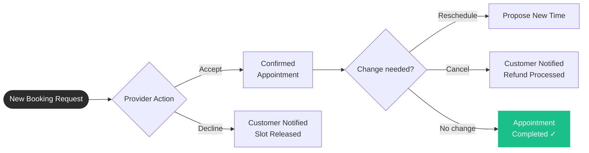

# Bookas Use Cases

This directory contains detailed use case documentation for the Bookas booking management system.

---

## Provider Setup Flow — Under 5 Minutes

A new provider goes from registration to ready-to-receive-bookings in 4 mandatory steps. Everything else is optional and can be configured at any time.

### Daily Operations Loop

Once live, the provider's day-to-day cycle looks like this:

> **Accept vs Decline vs Cancel** — These are three distinct actions:
> - **Accept** — Confirm a pending booking request (commitment made)
> - **Decline** — Refuse a pending request before any commitment (no obligation incurred)
> - **Cancel** — Break an already-confirmed commitment (may incur cancellation policy / refund)

---

## Use Cases

**28 use cases** across 8 sections. UC-001 → UC-028 follow the provider journey in order.

### Registration

| ID | Use Case | Page | Priority |
|----|----------|------|----------|
| [UC-001](./authentication/uc_001_user_registration.md) | User Registration | `/register` | High |
| [UC-002](./authentication/uc_002_user_login.md) | User Login | `/login` | High |
| [UC-003](./authentication/uc_003_password_recovery.md) | Password Recovery | `/forgot-password` | Medium |
| [UC-004](./onboarding/uc_002_provider_onboarding.md) | Provider Onboarding | `/onboarding-provider` | High |

> UC-004: 3 welcome slides followed by a forced redirect into company creation. Skippable but always ends at Create Company.

### Company

| ID | Use Case | Page | Priority |
|----|----------|------|----------|
| [UC-005](./company-management/uc_002_create_company.md) | Create Company | `/provider/companies/create` | High |
| [UC-006](./company-management/uc_003_edit_company.md) | Edit Company | `/provider/companies/:id/edit` | Medium |
| [UC-007](./company-management/uc_004_delete_company.md) | Delete Company | `/provider/companies` | Medium |
| [UC-008](./company-management/uc_001_view_companies.md) | View Companies | `/provider/companies` | High |
| [UC-009](./special-functions/uc_002_share_booking_link.md) | Share Booking Link | `/provider/companies/:id` | High |

### Services

| ID | Use Case | Page | Priority |
|----|----------|------|----------|
| [UC-010](./service-management/uc_002_create_service.md) | Create Service | `/provider/companies/:id/services/create` | High |
| [UC-011](./service-management/uc_003_edit_service.md) | Edit Service | `/provider/companies/:id/services` | Medium |
| [UC-012](./service-management/uc_004_delete_service.md) | Delete Service | `/provider/companies/:id/services` | Medium |
| [UC-013](./service-management/uc_001_view_services.md) | View Services | `/provider/companies/:id/services` | High |

### Calendar

| ID | Use Case | Page | Priority |
|----|----------|------|----------|
| [UC-014](./calendar-scheduling/uc_002_configure_working_hours.md) | Configure Working Hours | `/provider/hours` | High |
| [UC-015](./calendar-scheduling/uc_003_block_time_slots.md) | Block Time Slots | `/provider/block-time` | Medium |
| [UC-016](./calendar-scheduling/uc_004_unblock_time_slots.md) | Unblock Time Slots | `/provider/block-time` | Medium |
| [UC-017](./calendar-scheduling/uc_001_view_calendar.md) | View Calendar | `/provider/calendar` | High |

### Appointments

| ID | Use Case | Page | Priority |
|----|----------|------|----------|
| [UC-018](./appointment-management/uc_001_view_appointments.md) | View Appointments | `/provider/appointments` | High |
| [UC-019](./appointment-management/uc_002_view_appointment_details.md) | View Appointment Details | `/provider/appointments/:id` | High |
| [UC-020](./appointment-management/uc_003_accept_reject_appointment.md) | Accept / Decline Appointment | `/provider/appointments/:id` | Critical |
| [UC-021](./appointment-management/uc_005_reschedule_appointment.md) | Reschedule Appointment | `/provider/appointments/:id` | High |
| [UC-022](./appointment-management/uc_004_cancel_appointment.md) | Cancel Appointment | `/provider/appointments/:id` | High |
| [UC-023](./notifications-reports/uc_001_view_notifications.md) | View Notifications | `/provider/notifications` | High |

### Profile

| ID | Use Case | Page | Priority |
|----|----------|------|----------|
| [UC-024](./profile-settings/uc_002_edit_provider_profile.md) | Edit Provider Profile | `/provider/profile` | Medium |
| [UC-025](./profile-settings/uc_001_view_provider_profile.md) | View Provider Profile | `/provider/profile` | Medium |

### Analytics

| ID | Use Case | Page | Priority |
|----|----------|------|----------|
| [UC-026](./notifications-reports/uc_004_view_analytics_dashboard.md) | View Analytics Dashboard | `/provider` (dashboard) | High |

> MVP: 5 summary cards (today / this week / this month / pending / cancelled) + next upcoming appointment. Charts, revenue and export are post-MVP.

### Settings

| ID | Use Case | Page | Priority |
|----|----------|------|----------|
| [UC-027](./profile-settings/uc_003_manage_settings.md) | Manage Settings | `/provider/settings` | Medium |
| [UC-028](./notifications-reports/uc_002_manage_notification_preferences.md) | Notification Preferences | `/provider/settings` | Medium |

> UC-028 is a section within the Settings page, not a separate screen.

---

## Use Case Template

Each use case follows this structure:

**ID**: Unique identifier  
**Name**: Short descriptive name  
**Actor**: Who performs the action  
**Preconditions**: What must be true before the use case  
**Diagram**: Visual Mermaid sequence diagram showing actor-system interaction  
**Main Flow**: Step-by-step normal flow  
**Alternative Flows**: Variations or error cases  
**Postconditions**: State after successful completion  
**Business Rules**: Constraints and validations

### Diagram Notation

All use cases include **Mermaid sequence diagrams** that visualize:
- Actor-system interactions
- Data flow between components
- Decision points and alternative paths
- Integration with external services

These diagrams render automatically in GitHub, VS Code, and other Markdown viewers that support Mermaid.

---

*Last updated: March 11, 2026*

