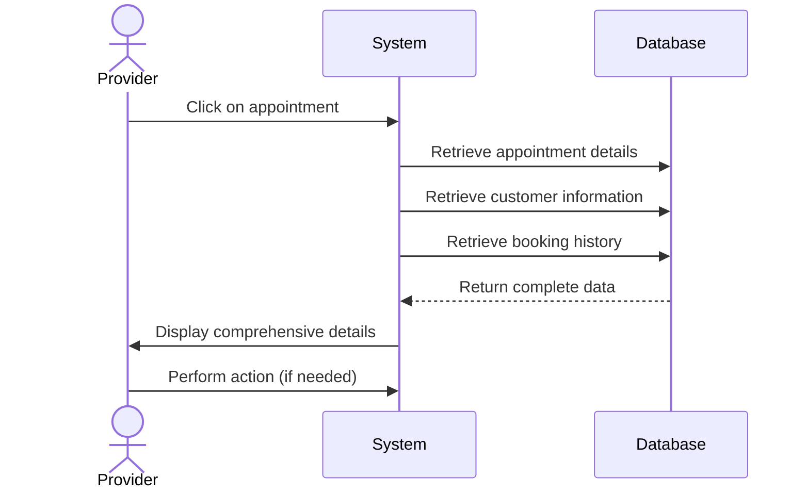

## UC-016: View Appointment Details

**Actor**: Provider  
**Preconditions**: Provider has appointments  
**Page**: `/provider/appointments/:id`

### Diagram

### Main Flow
1. Provider clicks on an appointment
2. System retrieves detailed appointment information
3. System displays comprehensive details:
   - **Customer Information**
     - Name
     - Contact details
     - Customer notes
     - Booking history
   - **Appointment Information**
     - Service details
     - Date and time
     - Duration
     - Location
     - Status
   - **Booking Details**
     - Booking ID
     - Booking date
     - Payment status
     - Total amount
     - Special requests
   - **Action Options**
     - Confirm/Reject (if pending)
     - Cancel
     - Reschedule
     - Mark as completed
     - Add notes
     - Contact customer
4. Provider can perform actions on the appointment

### Alternative Flows
**A1: Customer is New**
- System highlights first-time customer
- System shows complete customer profile
- Suggests sending welcome message

**A2: Special Requests Present**
- System highlights customer's special requests
- Provider can acknowledge requests
- Provider can add response notes

**A3: Payment Pending**
- System shows payment status prominently
- System displays payment options
- Provider can send payment reminder

### Postconditions
- Provider has complete appointment information
- Provider can make informed decisions
- Actions are available based on appointment status

### Business Rules
- All customer information is visible only to appointment provider
- Contact information is accessible based on privacy settings
- Action options depend on appointment status and time
- Historical notes and interactions are preserved

