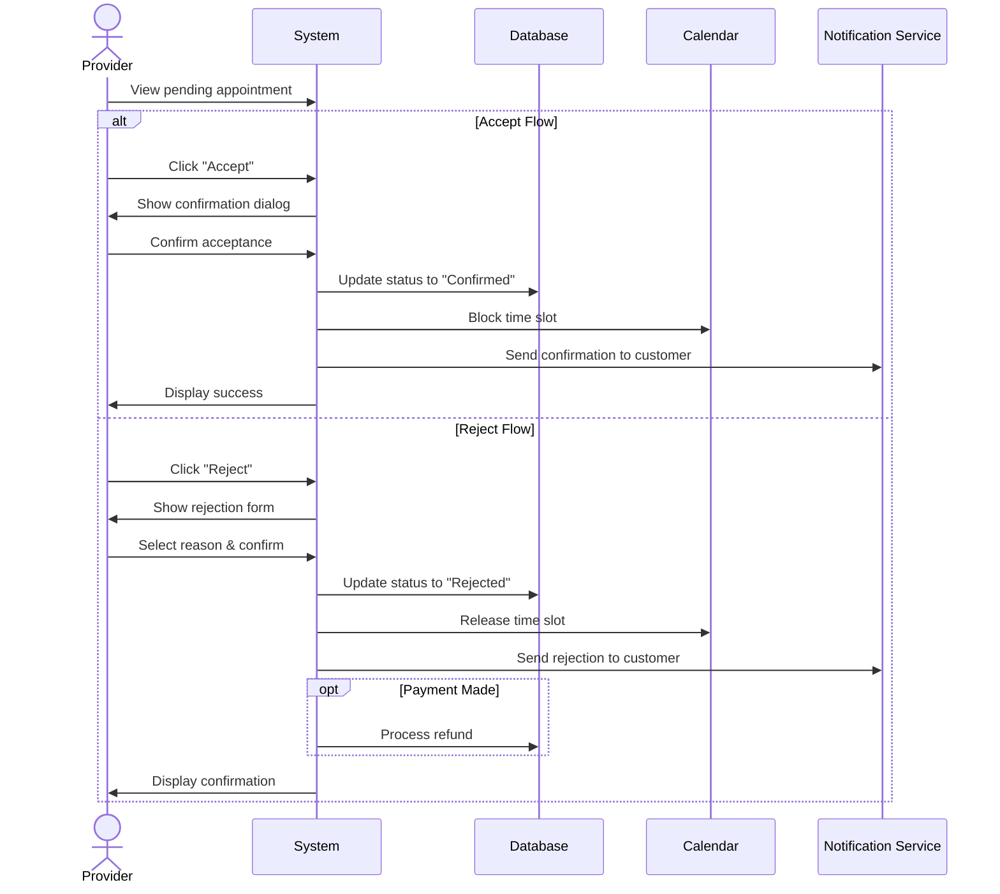

## UC-017: Accept/Reject Appointment

**Actor**: Provider  
**Preconditions**: Appointment is in "Pending" status  
**Page**: `/provider/appointments/:id`

### Diagram

### Main Flow - Accept
1. Provider views pending appointment
2. Provider clicks "Accept" button
3. System displays confirmation dialog
4. Provider adds optional message to customer
5. Provider confirms acceptance
6. System updates appointment status to "Confirmed"
7. System sends confirmation notification to customer
8. System adds appointment to provider's calendar
9. System displays success message

### Main Flow - Reject
1. Provider views pending appointment
2. Provider clicks "Reject" button
3. System displays rejection form
4. Provider selects rejection reason:
   - Not available at requested time
   - Service not offered
   - Outside service area
   - Other (with explanation)
5. Provider adds message to customer (optional)
6. Provider confirms rejection
7. System updates appointment status to "Rejected"
8. System sends rejection notification to customer
9. System processes refund (if payment made)
10. System displays confirmation

### Alternative Flows
**A1: Counter-Offer Time**
- Provider clicks "Suggest Alternative Time"
- System shows available time slots
- Provider selects alternative times
- System sends proposal to customer
- Customer can accept or decline

**A2: Request More Information**
- Provider clicks "Request Information"
- Provider specifies what information is needed
- System sends request to customer
- Appointment remains pending

**A3: Bulk Accept/Reject**
- Provider selects multiple pending appointments
- Provider chooses bulk action
- System processes all selected appointments
- Notifications sent to all affected customers

### Postconditions
**Accept**: 
- Appointment is confirmed
- Time slot is blocked in calendar
- Customer is notified
- Provider receives booking confirmation

**Reject**:
- Appointment is cancelled
- Time slot is released
- Customer is notified with reason
- Refund is processed if applicable

### Business Rules
- Pending appointments auto-reject after 24 hours if no action
- Rejection requires a reason
- Refunds are automatic for rejections
- Customer receives notification within 5 minutes
- Accepted appointments cannot be easily cancelled

