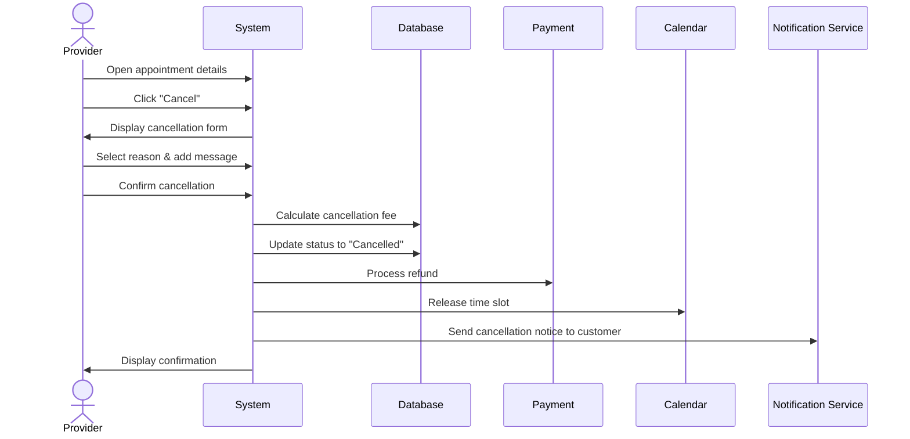

## UC-018: Cancel Appointment

**Actor**: Provider  
**Preconditions**: Appointment is confirmed or pending  
**Page**: `/provider/appointments/:id`

### Diagram

### Main Flow
1. Provider opens appointment details
2. Provider clicks "Cancel" button
3. System displays cancellation form with:
   - Cancellation reason options
   - Custom message field
   - Refund policy information
   - Impact warning
4. Provider selects cancellation reason
5. Provider adds explanation message
6. Provider reviews cancellation policy
7. Provider confirms cancellation
8. System updates appointment status to "Cancelled"
9. System processes refund according to policy
10. System sends cancellation notification to customer
11. System releases time slot
12. System displays confirmation

### Alternative Flows
**A1: Cancellation with Fee**
- System calculates cancellation fee based on timing
- System displays fee to provider
- Provider acknowledges fee responsibility
- System proceeds with cancellation

**A2: Late Cancellation (< 24 hours)**
- System warns about late cancellation policy
- System shows impact on provider rating
- Provider confirms understanding
- System proceeds with full refund to customer

**A3: Customer-Requested Cancellation**
- Customer initiates cancellation
- System notifies provider
- Provider can accept or dispute
- System processes accordingly

**A4: Emergency Cancellation**
- Provider marks as emergency
- System prioritizes notification
- System offers rebooking assistance
- Customer receives immediate alert

### Postconditions
- Appointment is cancelled
- Customer is notified
- Refund is processed
- Time slot is available again
- Cancellation is recorded in history

### Business Rules
- Cancellations >48 hours: no penalty
- Cancellations 24-48 hours: provider warning recorded
- Cancellations <24 hours: impacts provider rating
- Full refund to customer in all cases
- Excessive cancellations may trigger review
- Customer can rebook with 10% discount code

