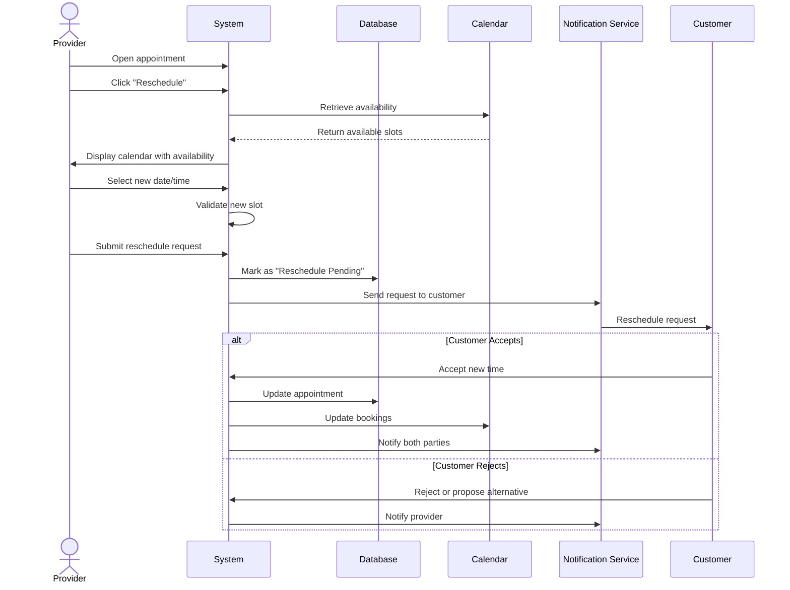

## UC-019: Reschedule Appointment

**Actor**: Provider  
**Preconditions**: Appointment exists and is not completed  
**Page**: `/provider/appointments/:id`

### Diagram

### Main Flow
1. Provider opens appointment details
2. Provider clicks "Reschedule" button
3. System displays provider's calendar with availability
4. Provider selects new date and time
5. System validates:
   - Time slot is available
   - Meets minimum advance notice
   - Within service availability
6. Provider adds reason for rescheduling (optional)
7. Provider adds message to customer
8. Provider submits reschedule request
9. System sends reschedule request to customer
10. System marks appointment as "Reschedule Pending"
11. Customer accepts or rejects
12. System updates appointment accordingly
13. System notifies provider of customer's decision

### Alternative Flows
**A1: Customer Accepts Reschedule**
- Customer accepts new time
- System updates appointment
- Both parties receive confirmation
- Calendar is updated

**A2: Customer Rejects Reschedule**
- Customer rejects new time
- Customer can propose alternative
- Provider can accept customer's suggestion
- If no agreement, appointment gets cancelled

**A3: Direct Reschedule (Provider Authority)**
- Provider has permission for direct changes
- System reschedules without approval request
- Customer receives notification of change
- Customer can cancel with full refund

**A4: Multiple Time Options**
- Provider offers 2-3 alternative times
- Customer selects preferred option
- System confirms selected time
- Other options are released

**A5: Reschedule Conflict**
- New time conflicts with another booking
- System prevents double-booking
- Provider must select different time

### Postconditions
- Appointment is rescheduled (if accepted)
- Both parties have updated information
- Calendar reflects changes
- Notifications are sent
- Original time slot is released

### Business Rules
- Reschedule requires at least 12 hours notice
- Customer approval required unless policy allows direct changes
- Maximum 3 reschedule requests per appointment
- No charge for provider-initiated reschedules
- Customer-requested reschedules follow cancellation policy timing
- Rescheduling window: between tomorrow and 60 days ahead

*Last updated: March 6, 2026*
