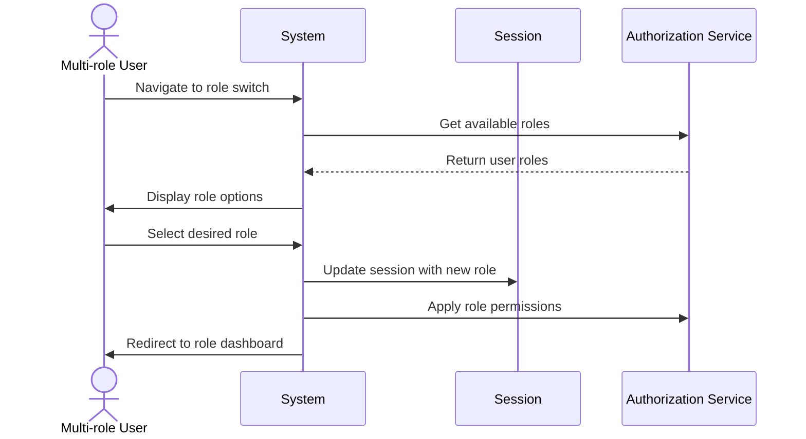

## UC-004: Role Switching

**Actor**: Authenticated User with multiple roles  
**Preconditions**: User is logged in and has access to multiple roles (e.g., Customer and Provider)  
**Page**: `/role-switch`

### Diagram

### Main Flow
1. User navigates to role switch page
2. System displays available roles for the user
3. User selects desired role
4. System updates user session with selected role
5. System redirects to appropriate dashboard for selected role

### Alternative Flows
**A1: Single Role User**
- System automatically assigns default role
- User is redirected to appropriate dashboard

**A2: Session Timeout During Switch**
- System logs out user
- User is redirected to login page

### Postconditions
- User's active role is switched
- User has access to role-specific features
- Session is updated with new role context

### Business Rules
- Only users with multiple approved roles can switch
- Role permissions are immediately applied after switch
- Previous role context is saved
