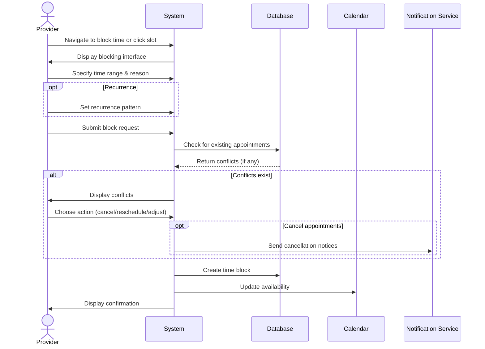

## UC-022: Block Time Slots

**Actor**: Provider  
**Preconditions**: Provider is logged in  
**Page**: `/provider/block-time` or `/provider/calendar`

### Diagram

### Main Flow
1. Provider navigates to block time page or clicks time slot on calendar
2. System displays blocking interface
3. Provider specifies blocking details:
   - Start date and time
   - End date and time
   - Reason for blocking:
     - Personal time off
     - Holiday
     - Meeting/Training
     - Maintenance
     - Other (custom reason)
   - Recurrence (optional):
     - Does not repeat
     - Daily
     - Weekly
     - Custom pattern
   - Affected companies (all or specific)
   - Internal notes
4. Provider submits block request
5. System checks for existing appointments in the range
6. System displays conflicts (if any)
7. Provider confirms despite conflicts OR adjusts time
8. System blocks the time slot
9. System prevents new bookings for that period
10. System displays confirmation

### Alternative Flows
**A1: Conflicts with Existing Appointments**
- System lists conflicting appointments
- System offers options:
  - Cancel existing appointments
  - Reschedule existing appointments
  - Adjust block time to avoid conflicts
- Provider chooses option
- System processes accordingly

**A2: Recurring Block**
- Provider sets recurrence pattern
- System shows preview of all blocked dates
- Provider confirms pattern
- System creates all block instances
- Each instance can be edited individually

**A3: Quick Block from Calendar**
- Provider clicks time slot on calendar directly
- System opens quick-block dialog
- Provider confirms time and reason
- System blocks immediately

**A4: Block Full Day**
- Provider selects "Block Full Day" option
- System blocks all working hours for selected date
- Multiple dates can be selected
- System processes bulk blocking

**A5: Emergency Block**
- Provider marks block as "Emergency"
- System automatically notifies affected customers
- System offers to reschedule affected appointments
- System prioritizes notifications

### Postconditions
- Time slots are blocked
- No new bookings can be made for blocked times
- Calendar shows blocked periods
- Block can be edited or removed later

### Business Rules
- Minimum block duration: 15 minutes
- Maximum advance block period: 2 years
- Blocks take precedence over working hours
- Overlapping blocks are merged
- Past times cannot be blocked
- Recurring blocks create separate instances
- Each block can be individually managed

