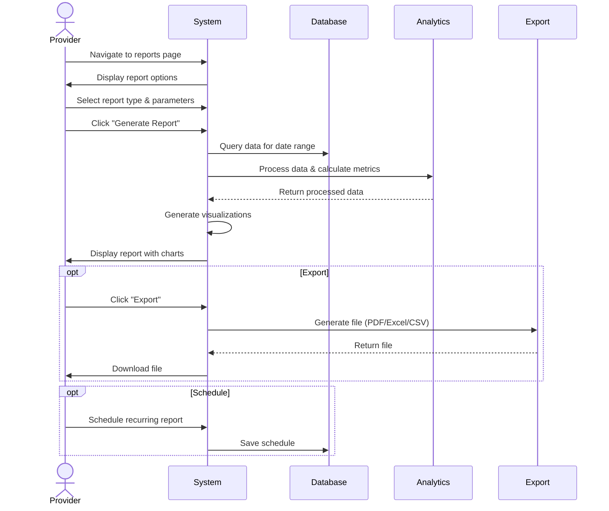

## UC-029: Generate Reports

**Actor**: Provider  
**Preconditions**: Provider is logged in and has booking history  
**Page**: `/provider/reports`

### Diagram

### Main Flow
1. Provider navigates to reports page
2. System displays report options dashboard
3. Provider selects report type:
   - **Financial Reports**
     - Revenue summary
     - Payment history
     - Refunds and cancellations
     - Outstanding payments
   - **Booking Reports**
     - Appointments summary
     - Completion rate
     - No-show rate
     - Popular services
   - **Customer Reports**
     - New vs returning customers
     - Customer demographics
     - Customer retention
     - Top customers
   - **Performance Reports**
     - Rating trends
     - Review analysis
     - Response time metrics
     - Utilization rate
   - **Time Reports**
     - Hours worked
     - Peak booking times
     - Seasonal trends
     - Availability utilization
4. Provider configures report parameters:
   - Date range (start and end date)
   - Filters (company, service, status)
   - Grouping (daily, weekly, monthly)
   - Comparison period (optional)
5. Provider clicks "Generate Report"
6. System processes data
7. System displays report with:
   - Summary statistics
   - Charts and visualizations
   - Detailed data tables
   - Trend analysis
8. Provider can export or share report

### Alternative Flows
**A1: Export Report**
- Provider clicks "Export" button
- System offers export formats:
  - PDF (for printing/sharing)
  - Excel/CSV (for analysis)
  - JSON (for integration)
- Provider selects format
- System generates download
- Provider receives file

**A2: Schedule Recurring Report**
- Provider clicks "Schedule Report"
- Provider configures:
  - Report type
  - Frequency (daily, weekly, monthly)
  - Delivery method (email, download)
  - Recipients
- System saves schedule
- System automatically generates and sends reports

**A3: Compare Periods**
- Provider enables "Compare with Previous Period"
- System adds comparison data
- Charts show comparison trends
- Percent changes are highlighted

**A4: Custom Report**
- Provider clicks "Custom Report Builder"
- Provider selects:
  - Data fields to include
  - Metrics to calculate
  - Grouping and sorting
  - Visualizations
- System generates custom report
- Provider can save as template

**A5: Insufficient Data**
- System detects insufficient data for report
- System displays message
- System suggests expanding date range
- System shows what data is available

**A6: Share Report**
- Provider clicks "Share"
- System generates shareable link
- Provider can set permissions
- Provider can add collaborators
- Recipients can view but not edit

### Postconditions
- Report is generated and displayed
- Provider has insights into business performance
- Data can be exported for further analysis
- Scheduled reports are queued for delivery

### Business Rules
- Historical data limited to account age
- Real-time data may have 15-minute delay
- Financial reports include tax information
- Custom reports limited to 10 saved templates
- Scheduled reports send at configured time
- Export file size limited to 50MB
- Sensitive data is redacted in shared reports

