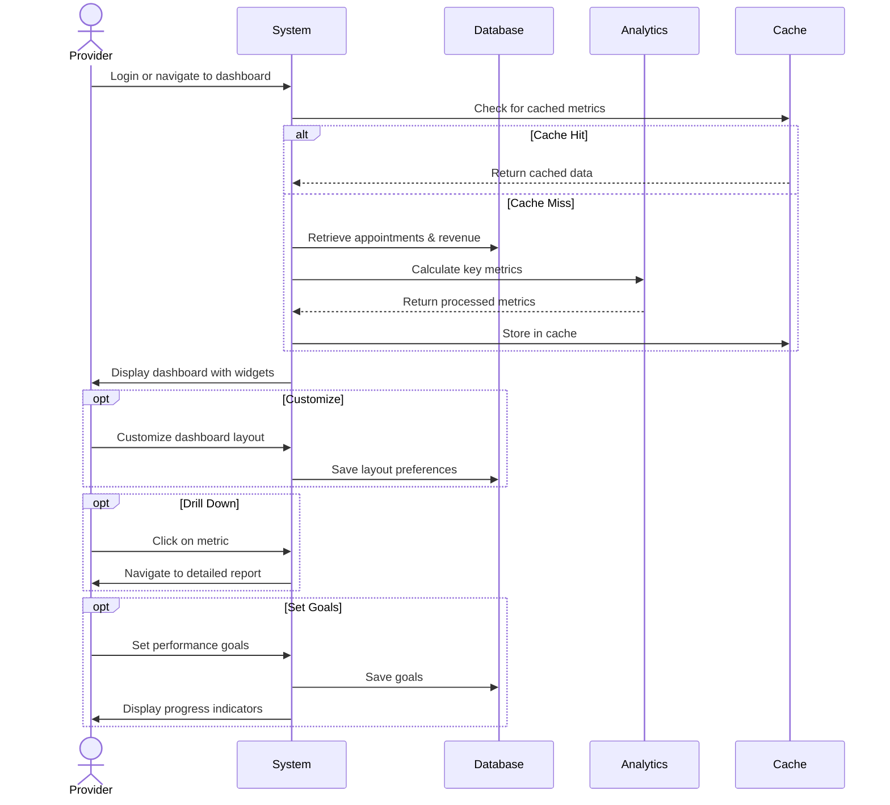

## UC-030: View Analytics Dashboard

**Actor**: Provider  
**Preconditions**: Provider is logged in  
**Page**: `/provider` (Dashboard)

### Diagram

### Main Flow
1. Provider logs in or navigates to dashboard
2. System retrieves provider's key metrics
3. System displays analytics dashboard with:
   - **Overview Cards**
     - Total bookings (today, this week, this month)
     - Revenue summary
     - Pending requests
     - Average rating
   - **Calendar Preview**
     - Today's appointments
     - Upcoming appointments
     - Available slots
   - **Performance Metrics**
     - Booking trend chart
     - Revenue trend chart
     - Customer satisfaction graph
   - **Quick Stats**
     - New customers this month
     - Repeat customer rate
     - Cancellation rate
     - Average booking value
   - **Recent Activity**
     - Latest bookings
     - Recent reviews
     - Recent notifications
   - **Quick Actions**
     - View all appointments
     - Create new company
     - Manage services
     - View reports
4. Provider can interact with dashboard elements
5. Provider can click through to detailed views
6. Provider can refresh data

### Alternative Flows
**A1: Customize Dashboard**
- Provider clicks "Customize Dashboard"
- System shows widget options
- Provider selects which widgets to display
- Provider arranges widget layout (drag & drop)
- Provider saves custom layout
- System applies custom dashboard

**A2: Filter by Date Range**
- Provider selects date range filter
- System updates all metrics for range
- Charts and graphs adjust accordingly
- Comparison to previous period shown

**A3: Filter by Company/Service**
- Provider selects company or service filter
- System displays metrics for selection only
- All widgets reflect filtered data

**A4: Drill Down into Metric**
- Provider clicks on metric card
- System navigates to detailed report
- Full data table is displayed
- Additional analysis options available

**A5: Export Dashboard**
- Provider clicks "Export Dashboard"
- System generates PDF snapshot
- Dashboard is formatted for printing
- Provider receives download

**A6: Set Goals**
- Provider clicks "Set Goals"
- Provider enters targets:
  - Monthly booking target
  - Revenue goal
  - Rating goal
- System tracks progress
- Dashboard shows progress indicators

### Postconditions
- Provider has comprehensive business overview
- Provider can make data-driven decisions
- Important metrics are immediately visible
- Provider can access detailed information as needed

### Business Rules
- Dashboard updates every 5 minutes
- Data accuracy: 99.9%
- Metrics calculated on trailing periods
- Currency displays in provider's configured currency
- Timezone matches provider's settings
- Historical comparisons show percent change
- Widgets can be hidden but not removed completely

*Last updated: March 6, 2026*
