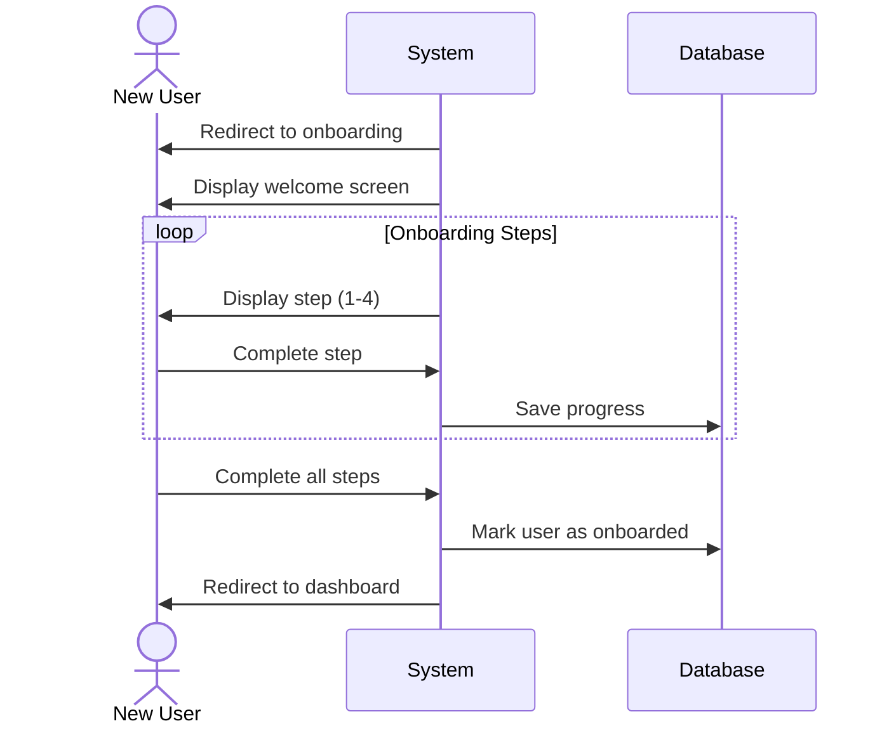

## UC-005: General User Onboarding

**Actor**: New User  
**Preconditions**: User has just registered but not completed onboarding  
**Page**: `/onboarding`

### Diagram

### Main Flow
1. System redirects newly registered user to onboarding page
2. System displays welcome screen with app introduction
3. User proceeds through onboarding steps:
   - **Step 1**: Personal information completion
   - **Step 2**: Preferences setup (notifications, language, etc.)
   - **Step 3**: Tutorial/Feature overview
   - **Step 4**: Confirmation and completion
4. User completes each step
5. System saves onboarding preferences
6. System marks user as onboarded
7. System redirects to main application dashboard

### Alternative Flows
**A1: Skip Onboarding**
- User clicks "Skip" button
- System shows confirmation dialog
- System marks partial onboarding completion
- User is redirected to dashboard with tutorial hints enabled

**A2: Exit During Onboarding**
- User closes or navigates away
- System saves progress
- System shows onboarding prompt on next login

**A3: Back Navigation**
- User clicks "Back" button
- System returns to previous onboarding step
- Previously entered data is preserved

### Postconditions
- User profile is complete
- User preferences are configured
- User is familiar with basic features
- User can access full application

### Business Rules
- Onboarding can be completed later
- Users can skip non-mandatory steps
- Onboarding progress is saved automatically
- Tutorial can be accessed later from help menu

