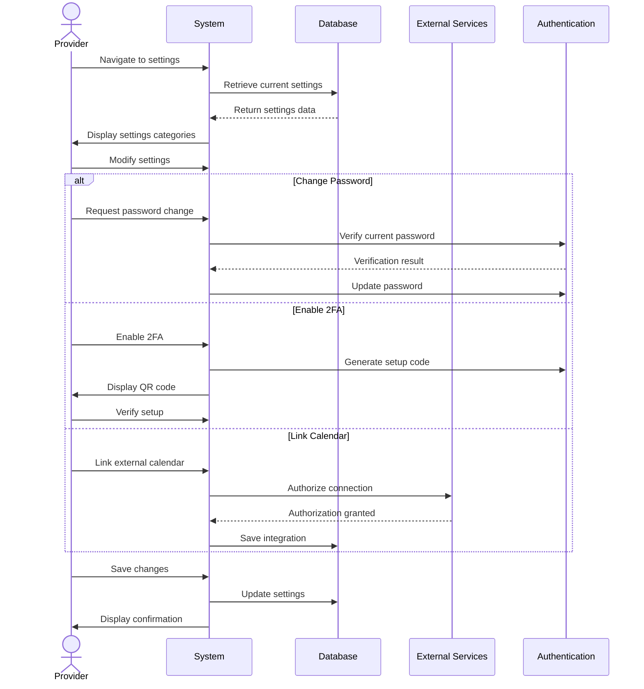

## UC-026: Manage Settings

**Actor**: Provider  
**Preconditions**: Provider is logged in  
**Page**: `/provider/settings`

### Diagram

### Main Flow
1. Provider navigates to settings page
2. System displays settings organized in categories:
   - **Account Settings**
     - Email and password
     - Two-factor authentication
     - Account status
     - Linked accounts
   - **Notification Preferences**
     - Email notifications
     - SMS notifications
     - Push notifications
     - Notification frequency
   - **Booking Settings**
     - Auto-accept bookings
     - Advance booking window
     - Cancellation policy
     - Buffer times
     - Maximum daily bookings
   - **Payment & Billing**
     - Payment methods
     - Payout schedule
     - Tax information
     - Pricing currency
   - **Privacy & Security**
     - Profile visibility
     - Data sharing preferences
     - Session management
     - Login history
   - **Calendar Integration**
     - Google Calendar sync
     - Outlook sync
     - Apple Calendar sync
     - iCal export
   - **Language & Region**
     - Interface language
     - Timezone
     - Date format
     - Currency
3. Provider modifies desired settings
4. Provider saves changes
5. System validates settings
6. System applies changes
7. System displays confirmation

### Alternative Flows
**A1: Change Password**
- Provider clicks "Change Password"
- System requests current password
- Provider enters current password
- Provider enters new password twice
- System validates password strength
- System updates password
- System sends confirmation email

**A2: Enable Two-Factor Authentication**
- Provider clicks "Enable 2FA"
- System displays setup options (SMS, App)
- Provider chooses method
- System generates setup code/QR
- Provider completes setup
- System verifies 2FA setup
- Provider receives backup codes

**A3: Configure Auto-Accept**
- Provider toggles auto-accept
- System shows configuration options:
  - Auto-accept for repeat customers only
  - Auto-accept up to X bookings per day
  - Auto-accept for specific services
  - Blackout dates
- Provider sets parameters
- System saves configuration

**A4: Set Cancellation Policy**
- Provider clicks "Edit Cancellation Policy"
- System shows policy templates:
  - Flexible (24 hour notice)
  - Moderate (48 hour notice)
  - Strict (72 hour notice)
  - Custom
- Provider selects or customizes policy
- System updates booking terms

**A5: Link External Calendar**
- Provider selects calendar service
- System redirects to authentication
- Provider authorizes access
- System establishes two-way sync
- System confirms successful linkage

**A6: Privacy Settings**
- Provider adjusts visibility settings
  - Profile visibility (Public/Private)
  - Contact information visibility
  - Last active status
  - Review visibility
- System applies privacy preferences
- Public profile updates accordingly

**A7: Export Data**
- Provider clicks "Export My Data"
- System prepares data export
- Provider receives download link via email
- Data includes all profile and booking information

**A8: Delete Account**
- Provider clicks "Delete Account"
- System shows warning and consequences
- System requires password confirmation
- System checks for pending bookings
- Provider confirms understanding
- System deactivates account
- System sends confirmation email

### Postconditions
- Settings are updated and applied
- System behavior reflects new settings
- Integration services are connected/disconnected
- User experience adapts to preferences

### Business Rules
- Password changes require current password verification
- 2FA is recommended but optional
- Some settings require email verification
- Cancellation policy applies to new bookings only
- Calendar sync is bidirectional
- Account deletion has 30-day grace period
- Critical setting changes send email notifications
- Payment settings may require identity verification

*Last updated: March 6, 2026*
