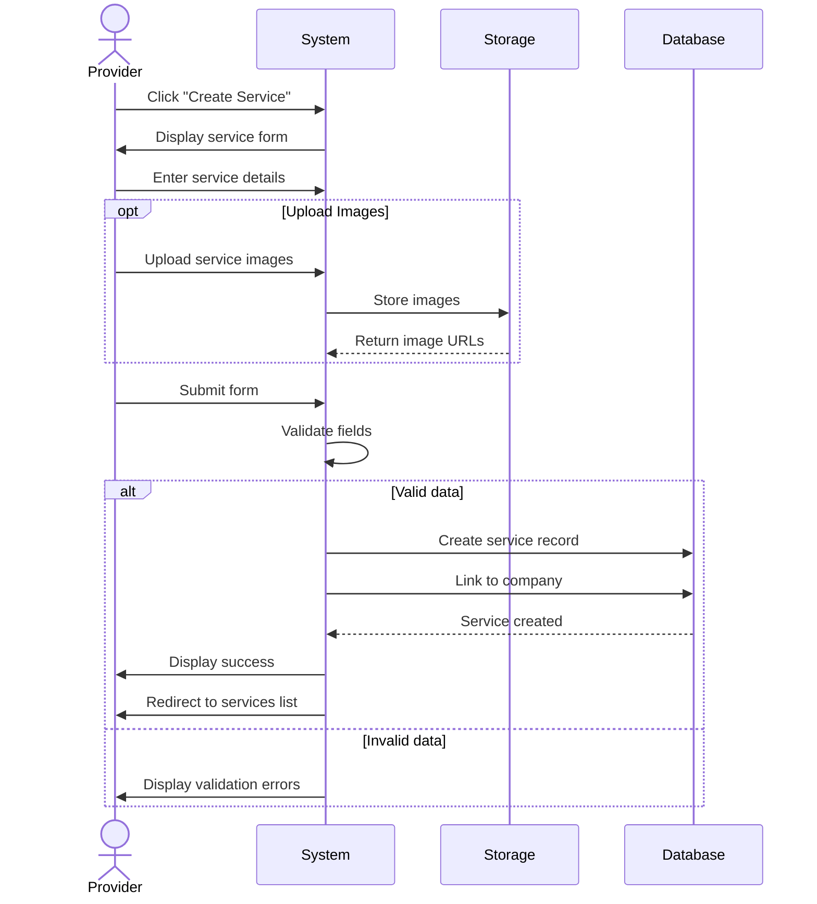

## UC-012: Create Service

**Actor**: Provider  
**Preconditions**: Provider has at least one company  
**Page**: `/provider/companies/:id/services/create`

### Diagram

### Main Flow
1. Provider clicks "Create Service" button
2. System displays service creation form
3. Provider enters service information:
   - Service name (required)
   - Service description (required)
   - Category/Type
   - Duration (required)
     - Hours
     - Minutes
   - Pricing (required)
     - Base price
     - Currency
     - Pricing type (Fixed/Hourly/Custom)
   - Advanced settings
     - Buffer time before/after
     - Advance booking period
     - Cancellation policy
     - Maximum bookings per day
     - Booking requirements/instructions
   - Service images/gallery
   - Availability
     - Specific days
     - Time slots
4. Provider uploads service images (optional)
5. Provider submits form
6. System validates all required fields
7. System creates service record
8. System links service to company
9. System displays success message
10. System redirects to services list

### Alternative Flows
**A1: Missing Required Fields**
- System highlights missing fields with error messages
- Provider completes required information
- Provider resubmits

**A2: Invalid Duration**
- System validates duration is positive
- System enforces minimum duration (e.g., 15 minutes)
- Provider enters valid duration

**A3: Invalid Pricing**
- System validates price is positive
- System validates currency format
- Provider corrects pricing

**A4: Image Upload Failure**
- System displays error message
- Provider can retry or skip images
- Images can be added later

**A5: Cancel Creation**
- Provider clicks "Cancel"
- System shows confirmation dialog
- System discards entered data
- Provider is redirected back

**A6: Save as Draft**
- Provider saves incomplete service
- System stores draft with status "Inactive"
- Provider can complete and activate later

### Postconditions
- New service is created and linked to company
- Service is available for booking (if activated)
- Service appears in company's service list

### Business Rules
- Service name must be unique within the company
- Duration must be between 15 minutes and 24 hours
- Price must be positive
- Maximum 10 images per service
- Image size limit: 5MB per image
- Buffer time cannot exceed service duration
- Advance booking period: 1 hour to 365 days

