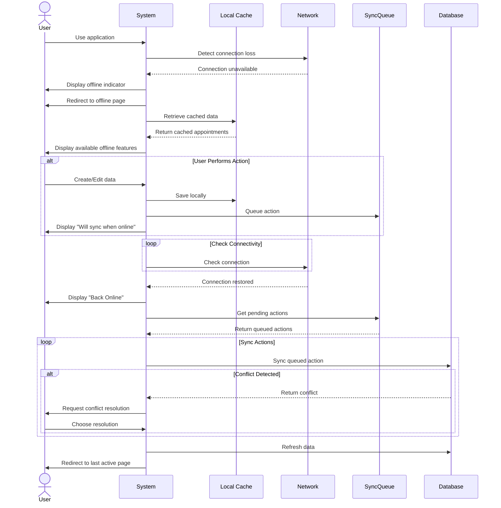

## UC-031: Offline Mode

**Actor**: Provider or User  
**Preconditions**: Network connection is lost or unavailable  
**Page**: `/offline`

### Diagram

### Main Flow
1. User is using the application
2. System detects network connection loss
3. System displays offline mode indicator
4. System automatically redirects to offline page
5. System displays offline status with:
   - Clear offline indicator
   - Last sync time
   - Available offline features
   - Connectivity status
   - Queue of pending actions
6. System enables limited offline functionality:
   - View cached appointments
   - View cached profile information
   - View downloaded reports
   - Draft new services/companies (saved locally)
7. User performs available offline actions
8. System queues actions for sync when online
9. System periodically checks for connectivity
10. When connection restored:
    - System displays "Back Online" message
    - System syncs queued actions
    - System refreshes data
    - System redirects to last active page

### Alternative Flows
**A1: View Cached Data**
- User requests to view appointments
- System displays last cached version
- System shows cache timestamp
- System indicates data may be outdated

**A2: Queue Actions for Later**
- User attempts to create/edit data
- System saves changes locally
- System displays "Will sync when online" message
- Changes are queued in sync queue
- User can view pending changes

**A3: Manual Sync Attempt**
- User clicks "Retry Connection"
- System attempts to connect
- If successful:
  - System syncs pending actions
  - System refreshes data
  - Normal mode resumes
- If failed:
  - System displays connection error
  - User remains in offline mode

**A4: Conflict Resolution**
- System comes online and detects conflicts
- Server data changed while offline
- System displays conflict resolution dialog
- User chooses resolution:
  - Keep server version
  - Keep local version
  - Merge changes (if possible)
- System applies selected resolution

**A5: View Sync Queue**
- User clicks "View Pending Actions"
- System displays list of queued actions:
  - Action type
  - Timestamp
  - Status (pending/failed)
- User can cancel pending actions
- User can prioritize actions

**A6: Download for Offline**
- User anticipates going offline
- User clicks "Download for Offline Use"
- System downloads:
  - Next 7 days of appointments
  - Essential profile data
  - Key reports
  - Company/service information
- System confirms data is cached
- User can access downloaded data offline

**A7: Clear Offline Cache**
- User clicks "Clear Offline Data"
- System shows cache size and contents
- User confirms clearing
- System removes cached data
- Fresh data downloads when online

### Postconditions
- User is informed of offline status
- Essential data remains accessible
- Actions are queued for synchronization
- User can continue limited functionality
- Data syncs automatically when connection restored

### Business Rules
- Cache stores up to 7 days of appointments
- Maximum cache size: 50MB
- Queued actions stored up to 7 days
- Sensitive data is encrypted in cache
- Offline mode limits real-time features
- Some actions cannot be performed offline:
  - New booking acceptance (requires real-time availability check)
  - Payment processing
  - Real-time calendar sync
  - Live notifications
- Sync queue processes in chronological order
- Conflicts always require user intervention
- Cache automatically refreshes every 24 hours when online

### Technical Notes
- Uses Service Workers for offline functionality
- LocalStorage/IndexedDB for data caching
- Background Sync API for automatic synchronization
- Network Information API for connection detection
- Progressive Web App (PWA) capabilities enabled

## Additional Special Use Cases

### UC-032: Bulk Operations (Implicit)

**Note**: While not explicitly shown as separate pages, bulk operations are supported throughout the application:

- **Bulk Appointment Actions**
  - Accept/reject multiple pending requests
  - Cancel multiple appointments
  - Export multiple appointments
  
- **Bulk Time Blocking**
  - Block multiple days at once
  - Apply recurring blocks
  - Bulk unblock operations

- **Bulk Service Management**
  - Activate/deactivate multiple services
  - Update pricing across services
  - Copy services between companies

### UC-033: Search and Discovery (Implicit)

**Search Functionality**:
- Global search across all entities
- Filters and advanced search
- Saved search queries
- Search history

**Implemented across**:
- Appointments search
- Company search
- Service search
- Customer search
- Notification search

### UC-034: Help and Support (Implicit)

**Support Features**:
- In-app help documentation
- Tutorial videos
- FAQ section
- Contact support
- Live chat (if enabled)
- Feedback submission

**Implemented via**:
- Help icon in navigation
- Contextual help tooltips
- Onboarding tutorials
- Settings → Help & Support

*Last updated: March 6, 2026*
